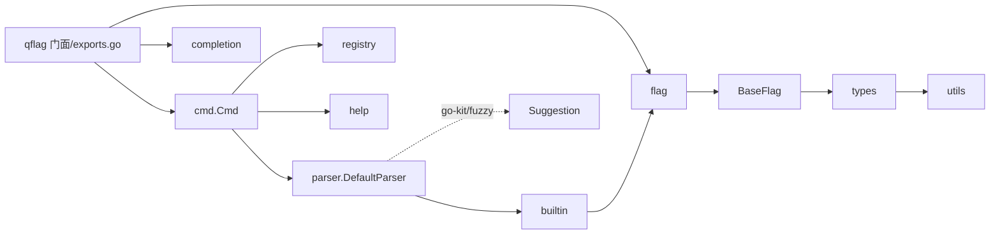

# AGENTS.md — QFlag 项目分析报告

---

## 一、项目概览

- **项目类型**：Go 语言**命令行参数解析库**（可复用框架），非业务应用。
- **模块名**：`gitee.com/MM-Q/qflag`；Go 版本 `1.25.0`（见 `go.mod`）。
- **许可证 / 托管**：MIT；Gitee（主）+ GitHub（同步）。
- **定位**：支持 18 种标志类型、子命令路由、互斥/必需组、标志依赖、环境变量绑定、Shell 补全、智能纠错、并发安全，目标是构建「专业 CLI 工具」的一站式框架。
- **外部依赖**：仅 `gitee.com/MM-Q/go-kit v0.0.19`（用于智能纠错的模糊匹配 `fuzzy`）。其余全部标准库。
- **文档**：`README.md`（特性/示例）、`APIDOC.md`（API 参考）；`_docs/` 为历史设计文档（40+ 篇）；`qflag-cli/` 为 CLI 开发技能包。
- **公开入口**：根包 `qflag`（`exports.go`）通过类型别名 / `var` 转发所有公共 API，并提供一个全局根命令 `qflag.Root`（`qflag.go`）。

---

## 二、目录结构梳理

```
qflag/
├── exports.go          # 公共 API 门面：类型别名、常量、构造器转发（Flag/Cmd/Parser 等）
├── qflag.go            # 全局根命令 Root、Parse/ParseOnce/ParseAndRoute 等便捷入口
├── parser_test.go      # 集成解析测试（含负值解析、边界值用例）
├── qflag_test.go       # 公共 API 冒烟测试
├── completion_test.go
├── go.mod / go.sum / LICENSE / README.md / APIDOC.md / .gitignore
├── internal/           # 核心实现（Go internal 约定，不可被外部包导入）
│   ├── types/          # 类型与接口核心：Flag/Command/Parser/注册表接口、错误类型、配置、FlagType 枚举
│   ├── cmd/            # Cmd 命令结构体（Command 接口实现），命令生命周期/标志/子命令管理，构造器
│   ├── parser/         # DefaultParser 解析器实现 + 互斥/必需/依赖校验 + 未知标志预扫描与智能纠错
│   ├── flag/           # 具体标志实现（泛型 BaseFlag + 各类型 Set/验证）
│   ├── registry/       # 泛型注册表（名称/短名双索引）
│   ├── completion/     # Shell 补全脚本生成（内嵌 bash/pwsh 模板）+ 动态补全
│   ├── builtin/        # 内置标志管理器与处理器（help/version/completion/install）
│   ├── help/           # 帮助信息生成器
│   ├── utils/          # 工具函数（标志名校验、格式化、排序、大小/切片转换）
│   └── mock/           # 测试用 Mock（MockCommand/MockFlag/MockParser/MockRegistry）
├── validators/         # 独立验证器库（范围/正则/邮箱/IP/端口/切片/字典/组合等）
├── _examples/          # 示例程序（10 个，每个一主题）
├── _docs/              # 历史设计/方案文档（非运行代码）
└── qflag-cli/          # qflag CLI 开发技能包
```

- local `internal/completion/templates/`：`bash.tmpl`、`pwsh.tmpl`、`bash_dynamic.tmpl`、`pwsh_dynamic.tmpl`（`go:embed` 打包）。
- `internal/`、`validators/` 各自对应的 `*_test.go` 与源码同目录（Go 惯例，规范）。
- **规范度评估**：分层清晰（types 接口层 / 实现层 / 工具层），遵循 Go internal + 同目录单测约定，结构规范。`_examples`、`_docs`、`qflag-cli` 承担「示例/文档/技能」职责，目录划分合理，无冗余目录。

### 关键文件与作用

| 文件 | 作用 |
|------|------|
| `internal/types/flag.go` | `Flag` 接口 + `FlagType` 枚举 + `Validator` 泛型类型（整个库的核心契约） |
| `internal/types/command.go` | `Command` 接口（命令的全部行为契约） |
| `internal/cmd/cmd.go` | `Cmd` 结构体，`Command` 的默认实现，读写锁并发安全 |
| `internal/parser/parser.go` | `DefaultParser` 解析流程编排（ParseOnly/Parse/ParseAndRoute） |
| `internal/flag/base_flag.go` | `BaseFlag[T]` 泛型基类，各具体标志复用的模板方法 |
| `internal/registry/impl.go` | 泛型注册表核心（双索引、冲突检测） |
| `internal/builtin/manager.go` | 内置标志注册与分发 |
| `exports.go` | 对外 API 门面（Alias） |
| `qflag.go` | `Root` 全局命令与便捷解析函数 |

---

## 三、核心功能模块识别

按「模块名称 — 核心功能 — 对应代码」分组，区分为**基础支撑**与**业务核心**（此处业务核心＝框架能力点）。

### 业务核心模块

| 模块 | 核心功能 | 对应实现 | 输入 / 输出 | 核心依赖 |
|------|----------|----------|-------------|----------|
| 命令管理 | 命令创建、标志/子命令管理、并发安全、解析状态 | `internal/cmd/cmd.go` | 输入 flags/subcmds；输出 Command 能力 | parser、registry、types、help |
| 标志类型系统 | 18 种具体标志的解析/设置/验证 | `internal/flag/*_flags.go` | 输入字符串值；输出类型化值 | BaseFlag、types.FlagType、utils |
| 参数解析 | 层解析、子命令递归、路由执行 | `internal/parser/parser.go` | 输入 args；输出解析结果/错误 | types.Parser、builtin、flag.FlagSet |
| 规则校验 | 互斥组/必需组（含条件性）/标志依赖 | `internal/parser/parser_validation.go` | 输入 config+已设标志；输出校验错误 | types.CmdConfig |
| 智能纠错 | 未知标志/子命令的模糊建议 | `internal/parser/suggestion.go` | 输入错误输入；输出建议 | go-kit/fuzzy、types 错误 |
| Shell 补全 | bash/pwsh 补全脚本生成与安装 | `internal/completion/*`、`internal/builtin/completion_handler.go` | 输入 Command；输出脚本字符串 | 内嵌 templates |
| 内置标志 | --help/--version/--completion/--install | `internal/builtin/*_handlers.go` | 输入 Command；输出动作 | flag、types |
| 帮助生成 | 命令帮助/logo/示例/排序 | `internal/help/gen.go` | 输入 Command；输出帮助文本 | types、utils |

### 基础支撑模块

| 模块 | 核心功能 | 对应实现 |
|------|----------|----------|
| 泛型注册表 | 标志/子命令的统一存储与查找 | `internal/registry/impl.go` |
| 验证器库 | 数值/字符串/时间/集合/组合验证器 | `validators/validators.go` |
| 类型与接口层 | 全库契约与枚举 | `internal/types/*` |
| 工具函数 | 校验标志名、格式化、排序、切片/大小转换 | `internal/utils/utils.go` |
| 测试辅助 | Mock 命令/标志/解析器 | `internal/mock/*` |

---

## 四、模块间依赖关系分析

### 依赖方向（单向，无环）

```
qflag（根门面） → exports.go → cmd / completion / flag / types
cmd ──→ parser ──→ builtin ──→ flag / types
   │        │           │
   │        └──→ types、go-kit/fuzzy(suggestion.go)
   ├──→ registry（保存 flagRegistry / cmdRegistry）
   └──→ help ──→ types / utils
flag ──→ BaseFlag ──→ types / utils
completion ──→ types（+ go:embed templates）
validators ──→ 仅标准库（net/mail/url/regexp/os/strconv/time/errors）
```

Mermaid 示意：



### 潜在问题
- **无明显循环依赖**（types 纯接口层被各实现引用，方向单向，架构健康）。
- **依赖适度**：除 go-kit/fuzzy 外零外依赖，无过度依赖。
- **注意点**：`cmd.Cmd.Parse*` 仅转发给 `parser.DefaultParser`，解析状态（`parsed`/`args`）由失效 `defer` 写回 Cmd，属「委托」而非强耦合依赖，扩展自定义 Parser 可行。
- `flag` 包内 `BaseFlag` 与各具体类型是继承复用（非接口依赖），新增类型需实现 `Set`（潜在纵向扩展点，见第六章）。

---

## 五、设计模式与实现逻辑

### 识别到的设计模式

| 模式 | 位置 | 应用场景 |
|------|------|----------|
| **外观模式 (Facade)** | `exports.go`、`qflag.go` | 根包统一对外暴露类型与快捷函数 |
| **接口 + 策略模式** | `types.Parser` 接口 + `parser.DefaultParser` | 可替换解析策略 |
| **模板方法** | `flag/base_flag.go` `BaseFlag[T]` | 基类定义骨架，子类重写 `Set`/`EnumValues` 实现具体解析 |
| **泛型工厂** | `cmd/flag.go` `Int/String/Bool/...` | 一键创建并注册各类型标志 |
| **注册表模式** | `internal/registry/impl.go` | 标志/子命令的名称索引存储 |
| **处理器分发** | `internal/builtin/manager.go` | 内建标志类型 → Handler 映射执行 |
| **命令模式** | `cmd.Cmd` + `Run()`/`SetRun` | 命令调用语义与延迟执行 |
| **策略枚举** | `types.ErrorHandling` | 错误处理策略（Continue/Exit/Panic） |
| **依赖注入（setter）** | `Cmd.SetParser` | 自定义解析器 |

### 核心流程拆解（参数解析主链路）

节点：`qflag.Parse()` → `Root.Parse(args)` → `parser.DefaultParser.Parse(cmd,args)` → 内部 `ParseOnly`：

```
1. 检查 IsDisableFlagParsing → 直接存 args 返回
2. 新建 flag.NewFlagSet，重置所有标志 (Reset)
3. 注册内置标志 (RegisterBuiltinFlags)
4. 注册所有业务标志 (registerFlag)
5. 预扫描 checkUnknownFlags → 未知标志报错+建议   ← 本项目近期修复点
6. flagSet.Parse(args)（标准库解析）
7. 加载环境变量（未由命令行设置时）
8. 构建已设标志映射 → 校验 互斥组→必需组→标志依赖
9. HandleBuiltinFlags（--help/--version 等）
10. Parse 阶段：未路由子命令则递归 sub.Parse(剩余)
    ParseAndRoute 阶段：命中则递归+执行目标 Run()
```

### 待优化观察（非缺陷）
- `checkUnknownFlags` 是标准库 `flag.FlagSet` 语义的**手写复刻**（已修复负值/单横杠），存在后续与标准库行为漂移的维护成本；当前已通过与标准库口径对齐并补测试。
- `validators.go` 的 `Positive/NonNegative/Optional` 用 `any(value).(type)` 反射式类型分支，泛型表面统一但实现含类型枚举，可读性尚可、性能非瓶颈。
- `registry.List()` 按 map 无序遍历返回，帮助/补全的顺序稳定性依赖上层 `utils` 排序（已实现），若未来有新消费方能出现顺序不确定性。

---

## 六、技术栈评估

| 类别 | 选型 | 说明 |
|------|------|------|
| 语言 | Go `1.25.0` | 泛型、标准库 `flag` 为核心解析引擎 |
| 框架/库 | 无第三方框架 | 库本身即框架；仅 `go-kit/fuzzy` 用于纠错 |
| 数据库 / 中间件 / 前端 | 无 | CLI 库场景，不需要 |
| 构建 | 标准 `go build`/`go test` | 无额外构建工具 |
| 测试 | 标准 `testing` 表驱动 | 各包同目录 `*_test.go` |

- **适配性**：选型与「纯 Go CLI 解析库」完全匹配；不引入 ORM/IO 框架，避免了小型库过度设计。泛型基类 + 双索引注册表是贴合场景的轻量方案。
- **版本/兼容**：`go.mod` 声明 `go 1.25.0`（较高），下游使用者需对应 Go 版本；对外只有 `go-kit v0.0.19` 一处第三方，兼容风险极低。**待确认**：`go 1.25.0` 相对 README 标注的 `1.24+` 略高，需确认公开承诺版本。
- **社区/维护**：标准库 + 自家 go-kit，无停止维护组件；项目自身双托管 Gitee/GitHub 持续活跃。**待确认**：go-kit v0.0.19 的发布节奏稳定度。

---

## 七、代码规范与异常处理

### 代码规范
- **命名**：统一驼峰；接口/实现分层（`Flag`/`FlagSet`、`BaseFlag[T]`），常量 `FlagType*`、依赖类型 `Dep*`，风格一致。
- **注释**：强制函数级注释（含入参/返回值/注意事项），大量中文注释 + 中英双语文案（`UseChinese` 控制）；规范度高，但单文件注释密度较高，有维护噪音（属可接受取舍）。
- **风格**：`gofmt` 对齐；`internal/` 分层符合标准布局；测试与源码同目录。
- **契约**：`Command`/`Parser`/`Flag`/`FlagRegistry`/`CmdRegistry` 均以接口定义，实现受契约约束。

### 异常处理
- **解析错误**：统一走 `ErrorHandling` 策略 + 自定义错误类型（`UnknownFlagError`/`UnknownSubcommandError`，带相似建议），用户信息友好（中文/英文可切换）。
- **错误传播**：`Parse*`/`AddFlag`/`AddSubCmds` 均显式 `error` 返回；构造函数（`Cmd.Int(...)`）在名称冲突时 **panic**（快速失败，符合「配置期错误」语义）。
- **nil 防御**：`AddFlag`/`AddSubCmds`/`Config()` 均有 nil 检查并返回结构化错误。
- **并发安全**：`Cmd` 全字段 `RWMutex` 保护；`ParseOnce` 用 `sync.Once`；`flagValueWrapper.IsBoolFlag` 等读路径加锁。核心流程异常处理完善。

---

## 八、扩展性与性能关键点

### 扩展性
- **新增标志类型**：继承 `BaseFlag[T]` 重写 `Set` 即可，注册/解析/校验管线自动接入（高内聚、易扩展）。
- **自定义解析器**：实现 `types.Parser` 后 `Cmd.SetParser` 注入（策略可替换）。
- **补全扩展**：`completion` 模板 + `EnumValues`/`FlagParam` 支持动态补全与枚举候选。

### 性能关键点
- **预分配**：`buildSetFlagsMap` 按 `len(flags)*2` 预分配 map，减扩容；验证用缓存 map 避免重复 `GetFlag`/`IsSet`。
- **O(1) 查找**：注册表按名称双索引；`EnumFlag` 用 map 查值。
- **潜在热点（低优先）**：`registry.List()` O(n) 每次全量副本且乱序；`Parser.ParseOnly` 每次解析重建 `FlagSet` 并全量 `Reset`；`validate*` 对多组多标志嵌套循环。对 CLI 场景规模（<数千标志）均无实际影响，标注为观察项而非问题。

---

## 九、项目核心特点、待优化点与结论

### 核心特点
1. **零依赖 + 泛型**：仅 1 个外部模块，核心值类型用 Go 泛型实现，类型安全且极轻量。
2. **接口优先的模块化**：types 接口层统一契约，cmd/parser/flag 等实现层解耦，无循环依赖。
3. **丰富的校验与分组能力**：互斥组、条件性必需组、标志依赖，远超标准库能力。
4. **开发体验完备**：双端 Shell 补全、智能纠错、中英双语帮助，可直接交付 CLI 用户。
5. **并发安全**：命令/标志/注册表均线程安全，支持并发访问。

### 待优化点
1. `checkUnknownFlags` 为标准库语义的手写复刻，存在语义漂移维护成本（已修复负值/单横杠并补测，仍建议随标准库演进持续对齐）。
2. 部分泛型验证器用反射式类型分支，可读性与类型化可再精炼。
3. `registry.List()` 无序可能导致未来新消费方顺序不定（帮助已做排序兜底）。
4. README 标注 Go `1.24+` 与 go.mod `1.25.0` 不一致，建议统一对外版本承诺（待确认）。
5. 注释密度较高，重构/文档维护时注意同步，避免注释与实际行为脱节。

### 静态分析关键结论（非变更记录）
- 项目为**高质量、结构化、零依赖倾向**的 Go CLI 解析库，架构（types接口层/实现层/工具层）清晰、单向依赖、无环。
- 解析链路 = 标准库 `flag.FlagSet` + 自研预扫描纠错 + 环境变量 + 分组校验 + 内置标志编排，层次明确。
- 近期完成的关键可靠件修复：预扫描对「负号开头值误判为未知标志」及「单独 `-` 过度拦截」的处理，均已与标准库口径对齐并通过白盒/集成测试。
- `_docs/` 沉淀了完整设计史（补全、内置标志、校验、帮助生成等），是理解演进的关键资料库。

---

## 维护规范

1. **第 1-9 章反映项目当前状态**，代码发生结构性变化时更新（新增模块、架构重构、重要功能等）
2. **记忆点顺序**：编号 1（最旧）→ 10（最新），从上到下按时间升序排列。新增记忆点时严格执行以下三步：
   - **第一步**：删除最旧的条目（即 `记忆点 1`）
   - **第二步**：将剩余条目顺移重新编号（原 2→1、原 3→2、……、原 10→9）
   - **第三步**：在末尾追加新条目作为 `记忆点 10`
3. **上限 10 条**，不得超出。禁止在顶部或中间插入新条目，新条目只追加在末尾
4. **所有文件引用必须使用项目相对路径**（如 `internal/parser/suggestion.go`），禁止绝对路径
5. **不要记录文件行数/大小统计**，此类信息变化频繁无维护价值
6. **详细的变更记录请写入项目内其他文档目录**，本文件仅作快速参考

### 记忆点

**记忆点 1**（初始架构基线）：
- 模块 `gitee.com/MM-Q/qflag`，Go 1.25.0；定位为 Go CLI 解析库，公开 API 门面在 `exports.go`，全局根命令 `qflag.Root` 在 `qflag.go`。
- 分层：`internal/types`（接口与类型）→ `internal/cmd`（Cmd 实现）→ `internal/parser`（DefaultParser 流程编排 + 校验 + 纠错）→ `internal/flag`（泛型 BaseFlag + 17 种标志）→ `internal/registry`（双索引进制表）；配套 `completion`、`builtin`、`help`、`utils`、`mock`；独立验证器库 `validators`。
- 能力点：互斥组/（条件性）必需组/标志依赖校验、环境变量绑定（命令行>环境变量>默认值）、Shell 补全（内嵌模板）、智能纠错（go-kit/fuzzy）、中英双语帮助。仅一个外依赖 `go-kit v0.0.19`。
- 解析主链路见第五章；`cmd.Cmd.Int(...)` 等构造器名冲突时 panic（快速失败），运行期错误走 `ErrorHandling` 策略。
- 近期已修复：`internal/parser/suggestion.go` 的 `checkUnknownFlags` 预扫描误判负号开头值/过度拦截单独 `-`，已对齐标准库 `flag` 语义并补充白盒（`suggestion_test.go`）与集成（pars.go 根测试）用例。

**记忆点 2**（新增 EnumHelp）：
- 新增公开辅助函数 `EnumHelp`（根包 `enum_help.go`），生成枚举标志帮助文本，支持 `值` 与 `值: 描述` 两种形态。
- 对齐按终端显示宽度计算（CJK/全角计 2 列，`isWideRune`），修复中英混排对齐失真。
- 自动跳过空值选项；解析约定：值本身不能含冒号（冒号仅作值与描述分隔），首个冒号拆分。
- 配套测试位于 `enum_help_test.go`，示例位于 `_examples/enum-help/`；已在 `APIDOC.md`、`README.md`、`qflag-cli` 技能包补充文档。