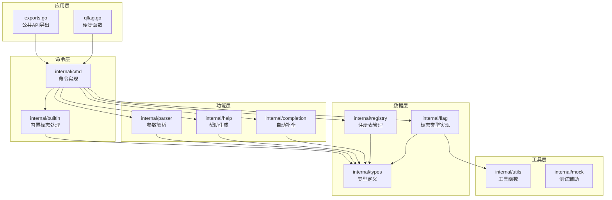
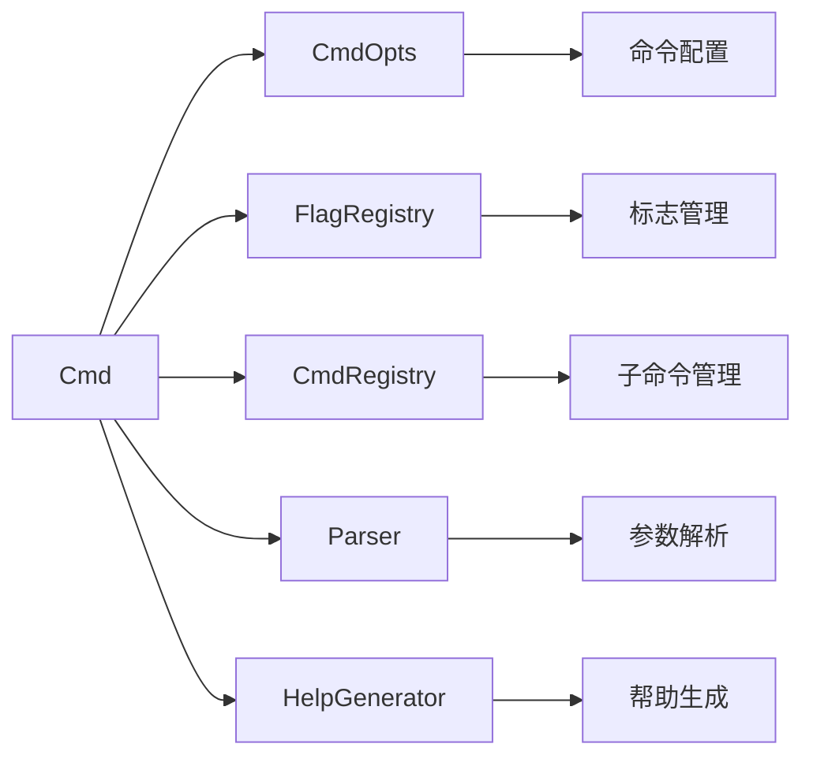
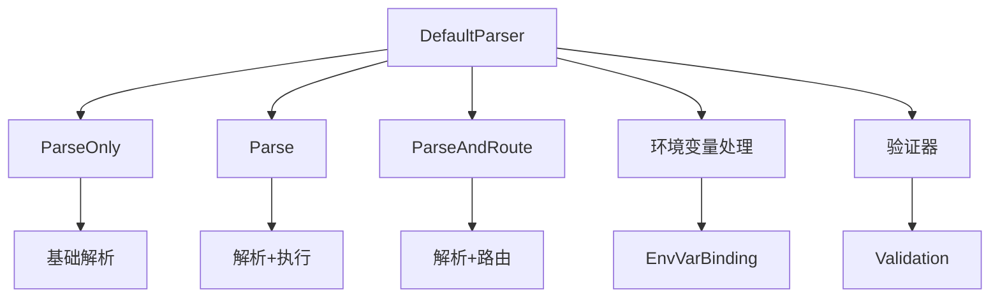
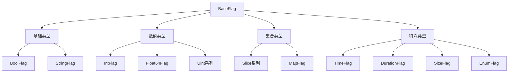
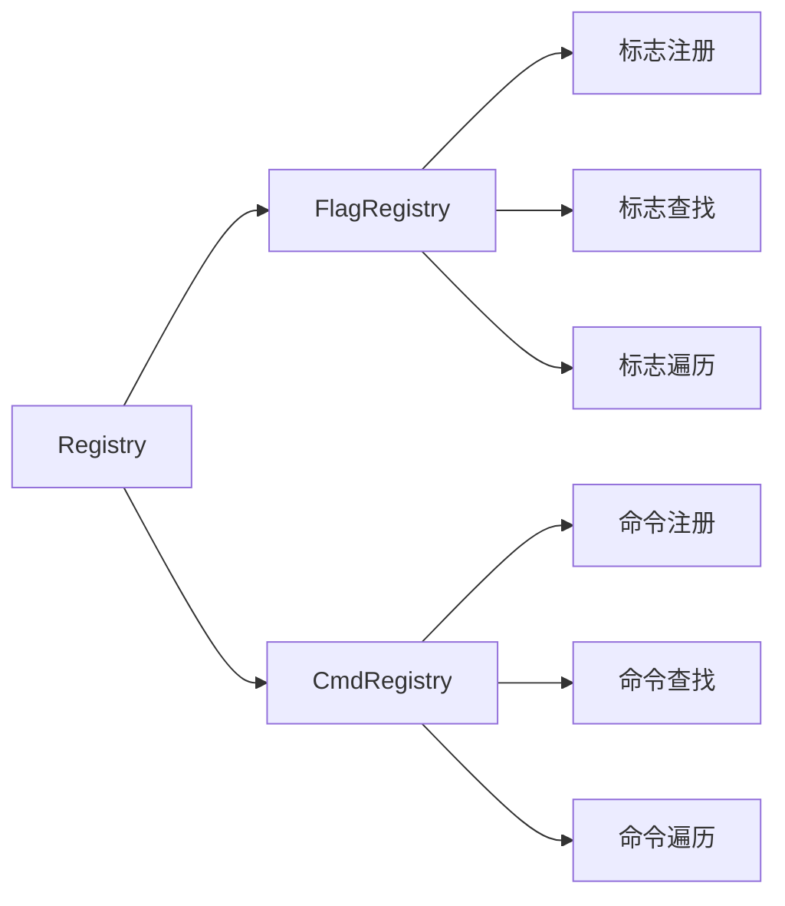
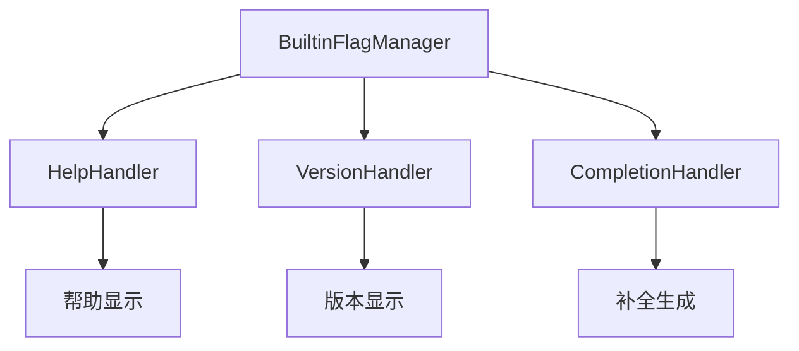
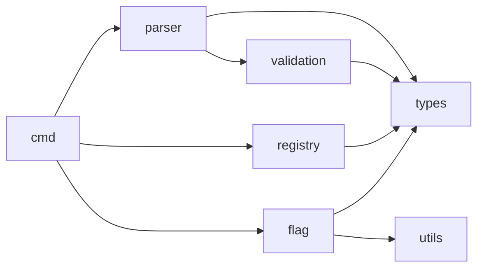

# QFlag 模块依赖关系

[TOC]

------

## 一、核心架构图



## 二、核心模块详解

### 1. 命令层 (internal/cmd)



**核心职责**:
- 命令创建与管理
- 标志注册与访问
- 子命令路由
- 参数解析协调

### 2. 解析器模块 (internal/parser)



**核心职责**:
- 命令行参数解析
- 环境变量处理
- 标志验证
- 子命令路由

### 3. 标志类型模块 (internal/flag)



**核心职责**:
- 标志类型实现
- 值解析与验证
- 环境变量绑定
- 帮助信息生成

### 4. 注册表模块 (internal/registry)



**核心职责**:
- 泛型注册表实现
- 标志/命令管理
- 并发安全访问
- 索引维护

### 5. 内置标志模块 (internal/builtin)



**核心职责**:
- 内置标志管理
- 特殊标志处理
- 自动注册机制

## 三、模块间依赖关系

### 1. 垂直依赖链

```
应用层 (exports.go, qflag.go)
    ↓
命令层 (internal/cmd)
    ↓
功能层 (parser, help, completion)
    ↓
数据层 (registry, flag, types)
    ↓
工具层 (utils, mock)
```

### 2. 水平依赖关系



## 四、关键依赖说明

### 1. 核心依赖

| 模块    | 依赖模块 | 依赖类型 | 说明            |
| ------- | -------- | -------- | --------------- |
| cmd     | types    | 接口依赖 | 使用Command接口 |
| cmd     | registry | 组合依赖 | 使用注册表管理  |
| cmd     | parser   | 组合依赖 | 使用解析器      |
| parser  | flag     | 组合依赖 | 解析标志值      |
| flag    | types    | 接口依赖 | 实现Flag接口    |
| builtin | cmd      | 接口依赖 | 处理命令        |

### 2. 循环依赖避免

- 所有模块都依赖 `types` 包
- `types` 包不依赖任何其他内部包
- 通过接口定义实现解耦

## 五、开发建议

### 1. 添加新功能

1. 在 `types` 包定义接口
2. 在对应模块实现功能
3. 通过 `cmd` 模块暴露API
4. 在 `exports.go` 导出公共接口

### 2. 添加新标志类型

1. 在 `flag` 包实现新类型
2. 继承 `BaseFlag`
3. 实现必要方法
4. 在 `cmd` 添加工厂方法

### 3. 添加新验证器

1. 在 `validators` 包实现
2. 在 `parser` 集成
3. 通过 `cmd` 暴露

## 六、模块职责总结

| 模块       | 核心职责 | 主要接口                  |
| ---------- | -------- | ------------------------- |
| types      | 类型定义 | Command, Flag, Parser     |
| cmd        | 命令管理 | Cmd, CmdOpts              |
| flag       | 标志实现 | BaseFlag[T], 各类型标志   |
| parser     | 参数解析 | Parser                    |
| registry   | 注册表   | FlagRegistry, CmdRegistry |
| builtin    | 内置标志 | BuiltinFlagHandler        |
| help       | 帮助生成 | GenHelp                   |
| completion | 自动补全 | Generate                  |
| utils      | 工具函数 | 各类辅助函数              |
| mock       | 测试辅助 | Mock实现                  |