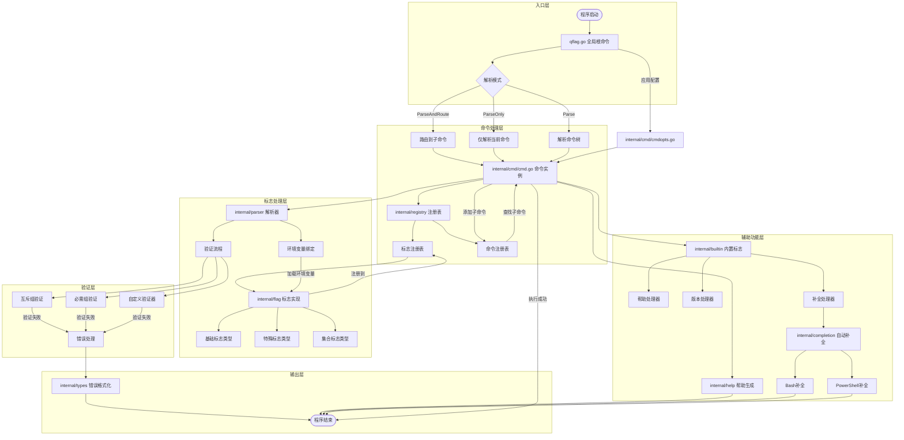
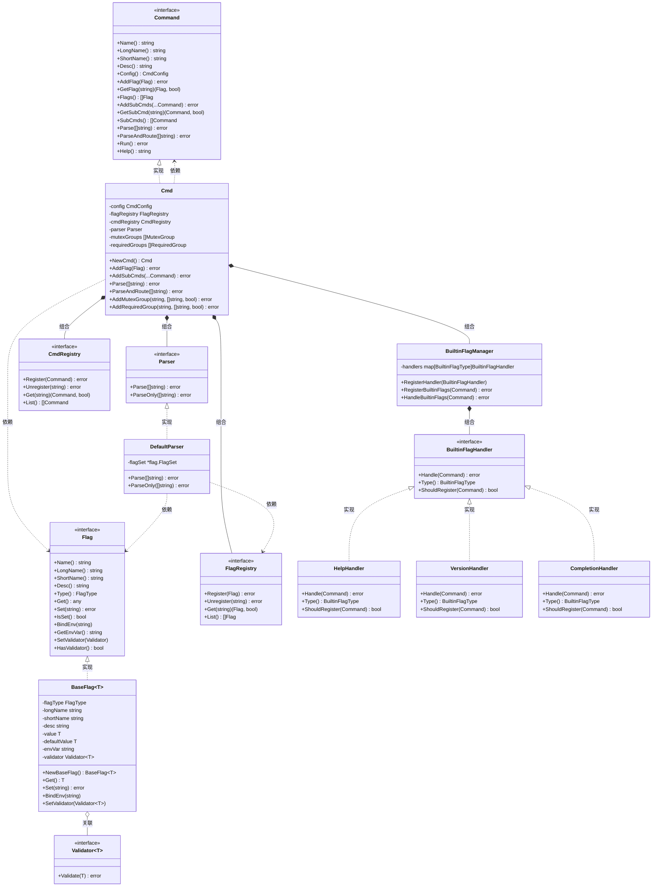
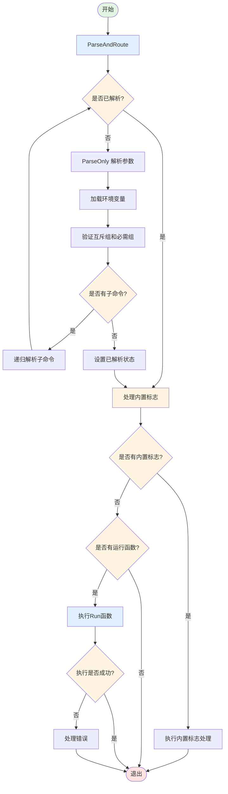

```mermaid
flowchart TD
    subgraph 入口层 [入口层]
        Start([程序启动]) --> qflag[qflag.go 全局根命令]
        qflag --> Parse{解析模式}
    end

    subgraph 命令处理层 [命令处理层]
        Parse -->|ParseAndRoute| Route[路由到子命令]
        Parse -->|ParseOnly| ParseCmd[仅解析当前命令]
        Parse -->|Parse| ParseTree[解析命令树]
        
        Route --> Cmd[internal/cmd/cmd.go 命令实例]
        ParseCmd --> Cmd
        ParseTree --> Cmd
        
        Cmd --> Reg[internal/registry 注册表]
        Reg --> FlagReg[标志注册表]
        Reg --> CmdReg[命令注册表]
    end

    subgraph 标志处理层 [标志处理层]
        FlagReg --> Flag[internal/flag 标志实现]
        Flag --> Basic[基础标志类型]
        Flag --> Special[特殊标志类型]
        Flag --> Collection[集合标志类型]
        
        Cmd --> Parser[internal/parser 解析器]
        Parser --> Env[环境变量绑定]
        Parser --> Validate[验证流程]
    end

    subgraph 验证层 [验证层]
        Validate --> Mutex[互斥组验证]
        Validate --> Required[必需组验证]
        Validate --> Custom[自定义验证器]
        
        Mutex -->|验证失败| Error[错误处理]
        Required -->|验证失败| Error
        Custom -->|验证失败| Error
    end

    subgraph 辅助功能层 [辅助功能层]
        Cmd --> Help[internal/help 帮助生成]
        Cmd --> Builtin[internal/builtin 内置标志]
        
        Builtin --> HelpHandler[帮助处理器]
        Builtin --> VersionHandler[版本处理器]
        Builtin --> CompletionHandler[补全处理器]
        
        CompletionHandler --> Completion[internal/completion 自动补全]
        Completion --> Bash[Bash补全]
        Completion --> Pwsh[PowerShell补全]
    end

    subgraph 输出层 [输出层]
        Error --> Format[internal/types 错误格式化]
        Format --> End([程序结束])
        
        Help --> End
        Bash --> End
        Pwsh --> End
        
        Cmd -->|执行成功| End
    end

    %% 连接关系
    qflag -->|应用配置| CmdOpts[internal/cmd/cmdopts.go]
    CmdOpts --> Cmd
    
    Env -->|加载环境变量| Flag
    Flag -->|注册到| FlagReg
    
    Cmd -->|添加子命令| CmdReg
    CmdReg -->|查找子命令| Cmd
```

```mermaid
classDiagram
    class Flag {
        <<interface>>
        +Name() string
        +LongName() string
        +ShortName() string
        +Desc() string
        +Type() FlagType
        +Get() any
        +Set(string) error
        +IsSet() bool
        +BindEnv(string)
        +GetEnvVar() string
        +SetValidator(Validator)
        +HasValidator() bool
    }

    class BaseFlag~T~ {
        -flagType FlagType
        -longName string
        -shortName string
        -desc string
        -value T
        -defaultValue T
        -envVar string
        -validator Validator~T~
        +NewBaseFlag() BaseFlag~T~
        +Get() T
        +Set(string) error
        +BindEnv(string)
        +SetValidator(Validator~T~)
    }

    class Command {
        <<interface>>
        +Name() string
        +LongName() string
        +ShortName() string
        +Desc() string
        +Config() CmdConfig
        +AddFlag(Flag) error
        +GetFlag(string) (Flag, bool)
        +Flags() []Flag
        +AddSubCmds(...Command) error
        +GetSubCmd(string) (Command, bool)
        +SubCmds() []Command
        +Parse([]string) error
        +ParseAndRoute([]string) error
        +Run() error
        +Help() string
    }

    class Cmd {
        -config CmdConfig
        -flagRegistry FlagRegistry
        -cmdRegistry CmdRegistry
        -parser Parser
        -mutexGroups []MutexGroup
        -requiredGroups []RequiredGroup
        +NewCmd() Cmd
        +AddFlag(Flag) error
        +AddSubCmds(...Command) error
        +Parse([]string) error
        +ParseAndRoute([]string) error
        +AddMutexGroup(string, []string, bool) error
        +AddRequiredGroup(string, []string, bool) error
    }

    class Parser {
        <<interface>>
        +Parse([]string) error
        +ParseOnly([]string) error
    }

    class DefaultParser {
        -flagSet *flag.FlagSet
        +Parse([]string) error
        +ParseOnly([]string) error
    }

    class FlagRegistry {
        <<interface>>
        +Register(Flag) error
        +Unregister(string) error
        +Get(string) (Flag, bool)
        +List() []Flag
    }

    class CmdRegistry {
        <<interface>>
        +Register(Command) error
        +Unregister(string) error
        +Get(string) (Command, bool)
        +List() []Command
    }

    class BuiltinFlagHandler {
        <<interface>>
        +Handle(Command) error
        +Type() BuiltinFlagType
        +ShouldRegister(Command) bool
    }

    class BuiltinFlagManager {
        -handlers map[BuiltinFlagType]BuiltinFlagHandler
        +RegisterHandler(BuiltinFlagHandler)
        +RegisterBuiltinFlags(Command) error
        +HandleBuiltinFlags(Command) error
    }

    class HelpHandler {
        +Handle(Command) error
        +Type() BuiltinFlagType
        +ShouldRegister(Command) bool
    }

    class VersionHandler {
        +Handle(Command) error
        +Type() BuiltinFlagType
        +ShouldRegister(Command) bool
    }

    class CompletionHandler {
        +Handle(Command) error
        +Type() BuiltinFlagType
        +ShouldRegister(Command) bool
    }

    class Validator~T~ {
        <<interface>>
        +Validate(T) error
    }

    Flag <|.. BaseFlag~T~ : 实现
    Command <|.. Cmd : 实现
    Parser <|.. DefaultParser : 实现
    BuiltinFlagHandler <|.. HelpHandler : 实现
    BuiltinFlagHandler <|.. VersionHandler : 实现
    BuiltinFlagHandler <|.. CompletionHandler : 实现

    Cmd *-- FlagRegistry : 组合
    Cmd *-- CmdRegistry : 组合
    Cmd *-- Parser : 组合
    Cmd *-- BuiltinFlagManager : 组合
    BuiltinFlagManager *-- BuiltinFlagHandler : 组合

    BaseFlag~T~ o-- Validator~T~ : 关联
    Cmd ..> Flag : 依赖
    Cmd ..> Command : 依赖
    DefaultParser ..> Flag : 依赖
    DefaultParser ..> FlagRegistry : 依赖
```

```mermaid
flowchart TD
    Start([开始]) --> Parse[ParseAndRoute]
    
    Parse --> CheckParsed{是否已解析?}
    CheckParsed -->|是| HandleBuiltin[处理内置标志]
    CheckParsed -->|否| ParseOnly[ParseOnly 解析参数]
    
    ParseOnly --> LoadEnv[加载环境变量]
    LoadEnv --> ValidateGroups[验证互斥组和必需组]
    ValidateGroups --> CheckSubCmd{是否有子命令?}
    
    CheckSubCmd -->|是| ParseSubCmd[递归解析子命令]
    CheckSubCmd -->|否| SetParsed[设置已解析状态]
    
    ParseSubCmd --> CheckParsed
    
    SetParsed --> HandleBuiltin
    HandleBuiltin --> CheckBuiltin{是否有内置标志?}
    
    CheckBuiltin -->|是| ExecuteBuiltin[执行内置标志处理]
    CheckBuiltin -->|否| CheckRunFunc{是否有运行函数?}
    
    ExecuteBuiltin --> Exit([退出])
    
    CheckRunFunc -->|是| RunFunc[执行Run函数]
    CheckRunFunc -->|否| Exit
    
    RunFunc --> CheckError{执行是否成功?}
    CheckError -->|是| Exit
    CheckError -->|否| HandleError[处理错误]
    
    HandleError --> Exit
    
    style Start fill:#e1f5e1
    style Exit fill:#ffe1e1
    style Parse fill:#e1f0ff
    style HandleBuiltin fill:#fff4e1
    style RunFunc fill:#e1f0ff
    style CheckParsed fill:#fff4e1
    style CheckSubCmd fill:#fff4e1
    style CheckBuiltin fill:#fff4e1
    style CheckRunFunc fill:#fff4e1
    style CheckError fill:#fff4e1

```

