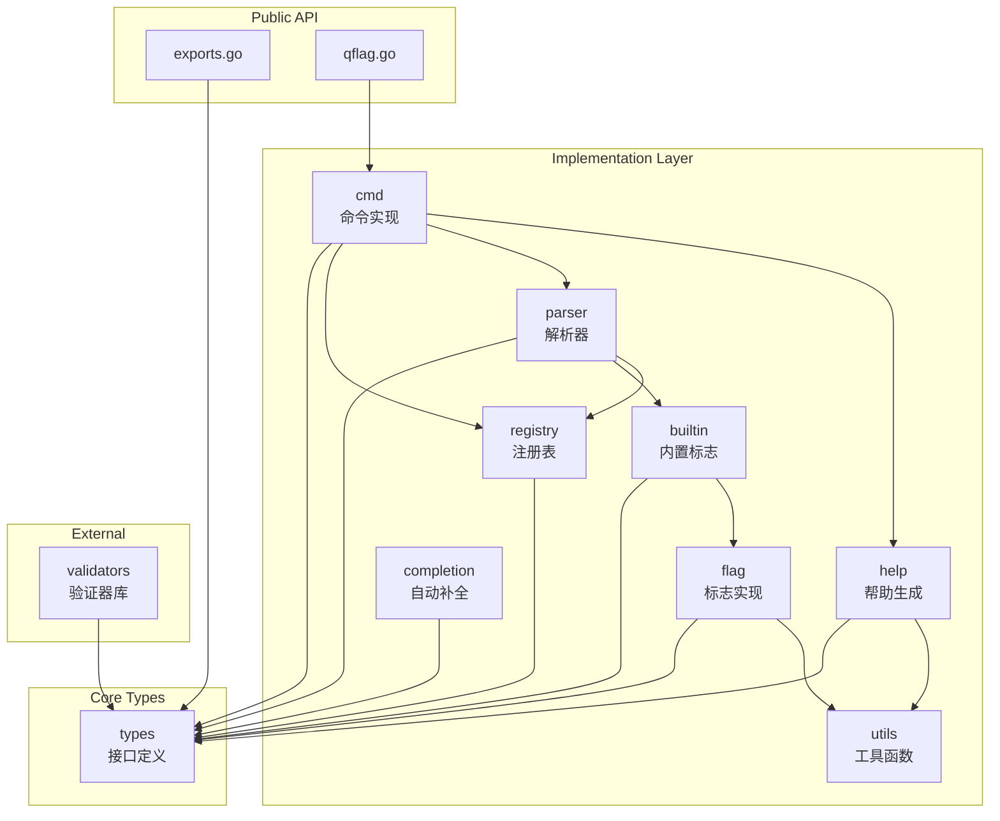

# QFlag 项目分析报告

> **项目概述**: QFlag 是一个专为 Go 语言设计的现代化命令行参数解析库  
> **分析日期**: 2026-04-05  
> **Go 版本**: 1.24.0  

---

## 一、目录结构梳理

### 1.1 项目根目录结构

```
qflag/
├── 📄 go.mod                    # Go 模块定义 (模块名: gitee.com/MM-Q/qflag)
├── 📄 README.md                 # 项目文档和快速入门指南
├── 📄 LICENSE                   # MIT 许可证
├── 📄 exports.go                # 公共接口和类型的统一导出文件
├── 📄 qflag.go                  # 全局根命令实例和便捷函数
├── 📄 APIDOC.md                 # API 文档
├── 📄 FLAG_USAGE.md             # 标志使用指南
├── 📄 qflag_test.go             # 主包测试文件
├── 📄 parser_test.go            # 解析器测试文件
├── 📄 completion_test.go        # 自动补全测试文件
│
├── 📁 docs/                     # 设计文档目录
│   ├── IMPLEMENTATION_PLAN.md   # 实现计划
│   ├── REFACTOR_PLAN.md         # 重构计划
│   ├── VALIDATOR_DESIGN.md      # 验证器设计文档
│   ├── COMPLETION_DESIGN.md     # 自动补全设计文档
│   └── ... (共 20+ 份设计文档)
│
├── 📁 internal/                 # 内部实现目录 (Go 规范)
│   ├── types/                   # 核心类型和接口定义
│   ├── flag/                    # 标志类型实现
│   ├── cmd/                     # 命令实现
│   ├── parser/                  # 解析器实现
│   ├── registry/                # 注册表实现
│   ├── builtin/                 # 内置标志管理
│   ├── help/                    # 帮助信息生成
│   ├── completion/              # 自动补全功能
│   ├── utils/                   # 工具函数
│   └── mock/                    # 测试模拟对象
│
├── 📁 validators/               # 验证器库 (公共包)
│   ├── validators.go            # 内置验证器实现
│   └── validators_test.go       # 验证器测试
│
├── 📁 examples/                 # 示例代码
│   ├── builtin-flags/           # 内置标志示例
│   ├── cmdopts/                 # 命令选项示例
│   ├── flag-constructors/       # 标志构造器示例
│   ├── mutex-group/             # 互斥组示例
│   ├── nested-commands/         # 嵌套命令示例
│   └── required-groups/         # 必需组示例
│
└── 📁 qflag-cli/                # CLI 工具相关文档
    ├── SKILL.md                 # 技能文档
    └── references/              # 参考资料
```

### 1.2 目录规范评估

| 评估维度 | 评分 | 说明 |
|---------|------|------|
| 目录命名规范 | ✅ 优秀 | 遵循 Go 项目标准规范，使用小写、短横线分隔 |
| 目录结构清晰 | ✅ 优秀 | 按职责分层明确，internal 包隔离内部实现 |
| 文档完整性 | ✅ 优秀 | 设计文档、API 文档、使用指南齐全 |
| 示例覆盖度 | ✅ 良好 | 涵盖主要功能场景 |
| 测试文件分布 | ✅ 规范 | 测试文件与源码文件同目录或带 `_test` 后缀 |

---

## 二、核心功能模块识别

### 2.1 基础支撑模块

| 模块名称 | 核心功能 | 对应代码文件 | 依赖资源 |
|---------|---------|-------------|---------|
| **类型系统 (types)** | 定义核心接口和类型 | `internal/types/*.go` | 标准库 flag |
| **注册表 (registry)** | 标志和命令的注册管理 | `internal/registry/*.go` | types |
| **工具函数 (utils)** | 格式化、排序等通用功能 | `internal/utils/utils.go` | 无 |
| **验证器 (validators)** | 参数值验证函数库 | `validators/validators.go` | 标准库 |

### 2.2 业务核心模块

| 模块名称 | 核心功能 | 对应代码文件 | 核心输入/输出 |
|---------|---------|-------------|--------------|
| **标志系统 (flag)** | 17种标志类型的实现 | `internal/flag/*.go` | 输入: 字符串参数 → 输出: 类型化值 |
| **命令系统 (cmd)** | 命令结构体和生命周期管理 | `internal/cmd/cmd.go` | 输入: 参数列表 → 输出: 解析结果 |
| **解析器 (parser)** | 命令行参数解析和路由 | `internal/parser/*.go` | 输入: os.Args → 输出: 命令树 |
| **内置标志 (builtin)** | --help、--version、--completion | `internal/builtin/*.go` | 输入: 命令配置 → 输出: 内置标志 |
| **帮助生成 (help)** | 自动生成帮助文档 | `internal/help/gen.go` | 输入: 命令配置 → 输出: 帮助文本 |
| **自动补全 (completion)** | Bash/PowerShell 补全脚本 | `internal/completion/*.go` | 输入: 命令树 → 输出: 补全脚本 |

### 2.3 标志类型支持列表

```
基础类型 (10种):
  ├── String      - 字符串
  ├── Bool        - 布尔值
  ├── Int         - 整数
  ├── Int64       - 64位整数
  ├── Uint        - 无符号整数
  ├── Uint8       - 8位无符号整数
  ├── Uint16      - 16位无符号整数
  ├── Uint32      - 32位无符号整数
  ├── Uint64      - 64位无符号整数
  └── Float64     - 64位浮点数

特殊类型 (3种):
  ├── Enum        - 枚举类型
  ├── Duration    - 持续时间
  ├── Time        - 时间点
  └── Size        - 存储大小

集合类型 (4种):
  ├── Map         - 键值对映射
  ├── StringSlice - 字符串切片
  ├── IntSlice    - 整数切片
  └── Int64Slice  - 64位整数切片
```

---

## 三、模块间依赖关系分析

### 3.1 依赖关系图 (Mermaid)



### 3.2 依赖关系说明

| 依赖方向 | 依赖类型 | 说明 |
|---------|---------|------|
| `types` ← 所有模块 | 接口依赖 | types 包定义核心接口，被所有实现模块依赖 |
| `flag` → `types` | 实现依赖 | 标志类型实现 types.Flag 接口 |
| `registry` → `types` | 实现依赖 | 注册表实现 types.Registry 接口 |
| `cmd` → `registry/parser/help` | 组合依赖 | 命令组合使用注册表、解析器和帮助生成器 |
| `parser` → `builtin` | 功能依赖 | 解析器调用内置标志管理器 |
| `exports` → `internal/*` | 导出依赖 | 导出内部实现为公共 API |

### 3.3 依赖健康度评估

- ✅ **无循环依赖**: 模块间依赖关系清晰，无循环依赖
- ✅ **分层合理**: types → internal → public API 三层架构清晰
- ✅ **接口隔离**: 通过 types 包定义接口，实现模块解耦
- ⚠️ **待确认**: parser 与 builtin 之间的耦合度较高

---

## 四、设计模式与实现逻辑

### 4.1 设计模式识别

| 设计模式 | 应用场景 | 代码位置 |
|---------|---------|---------|
| **泛型模式 (Generics)** | BaseFlag[T] 支持多种类型 | `internal/flag/base_flag.go` |
| **工厂模式 (Factory)** | 标志创建函数 | `internal/flag/*_flags.go` |
| **注册表模式 (Registry)** | 标志和命令的管理 | `internal/registry/*.go` |
| **策略模式 (Strategy)** | 验证器函数作为策略 | `types/flag.go: Validator[T]` |
| **模板方法 (Template Method)** | 基础标志定义流程，子类实现 Set | `internal/flag/base_flag.go` |
| **单例模式 (Singleton)** | 全局根命令 Root | `qflag.go: var Root *Cmd` |
| **组合模式 (Composite)** | 命令树结构（父子命令） | `internal/cmd/cmd.go` |

### 4.2 核心实现逻辑

#### 4.2.1 泛型标志基类设计

```go
// BaseFlag[T] 是所有标志类型的基础结构
// 使用泛型支持多种数据类型，避免重复代码
type BaseFlag[T any] struct {
    mu        sync.RWMutex       // 读写锁保证并发安全
    value     *T                 // 当前值指针
    default_  T                  // 默认值
    isSet     bool               // 标志是否已被设置
    envVar    string             // 关联的环境变量名
    validator types.Validator[T] // 验证器函数
    
    // 不可变属性
    longName  string
    shortName string
    desc      string
    flagType  types.FlagType
}
```

**设计亮点**:
- 使用泛型避免为每种类型重复编写相似代码
- 读写锁保护可变状态，确保并发安全
- 不可变属性无需加锁，提高读取性能

#### 4.2.2 解析流程

```
ParseAndRoute 执行流程:
1. ParseOnly(cmd, args)
   ├── 创建新的 FlagSet
   ├── 重置所有标志到默认状态
   ├── 注册内置标志 (--help, --version, --completion)
   ├── 注册用户定义的标志
   ├── 解析命令行参数 (flagSet.Parse)
   ├── 加载环境变量 (如果标志未被设置)
   ├── 验证互斥组规则
   ├── 验证必需组规则
   └── 处理内置标志
2. 检查剩余参数是否为子命令
3. 如果是子命令，递归调用 ParseAndRoute
4. 执行当前命令的 Run 函数
```

#### 4.2.3 全局根命令设计

```go
// Root 全局根命令实例，提供对全局标志和子命令的访问
var Root *Cmd

func init() {
    // 使用可执行文件名作为命令名
    cmdName := filepath.Base(os.Args[0])
    Root = NewCmd(cmdName, "", ExitOnError)
}

// 便捷函数直接委托给 Root
func Parse() error { return Root.Parse(os.Args[1:]) }
func AddSubCmds(cmds ...Command) error { return Root.AddSubCmds(cmds...) }
```

**设计亮点**:
- 提供零配置的快速使用方式
- 自动使用可执行文件名作为命令名
- 便捷函数简化 API 调用

### 4.3 代码质量评估

| 评估项 | 评分 | 说明 |
|-------|------|------|
| 泛型使用 | ✅ 优秀 | 合理使用泛型减少代码重复 |
| 并发安全 | ✅ 优秀 | 所有公共方法都有锁保护 |
| 接口设计 | ✅ 优秀 | 接口定义清晰，职责单一 |
| 错误处理 | ✅ 良好 | 使用 Go 标准错误处理方式 |
| 注释规范 | ✅ 优秀 | 函数级注释详细完整 |
| 命名规范 | ✅ 优秀 | 遵循 Go 命名规范 |

---

## 五、技术栈评估

### 5.1 核心技术栈

| 技术组件 | 版本/说明 | 用途 |
|---------|----------|------|
| Go | 1.24.0 | 编程语言 |
| 标准库 flag | 内置 | 底层参数解析 |
| 标准库 sync | 内置 | 并发控制 (RWMutex) |
| 标准库 strings | 内置 | 字符串处理 |
| 标准库 fmt | 内置 | 格式化输出 |

### 5.2 技术选型分析

**优势**:
- ✅ **零外部依赖**: 仅使用 Go 标准库，降低依赖风险
- ✅ **兼容性**: 兼容标准库 flag 包的 ErrorHandling 类型
- ✅ **现代化**: 使用 Go 1.18+ 泛型特性

**潜在考虑**:
- ⚠️ **Go 版本要求**: 需要 Go 1.24.0，较新版本可能限制部分用户使用
- ⚠️ **标准库 flag 依赖**: 底层依赖标准库 flag，受其限制

### 5.3 版本兼容性

```
当前要求: Go 1.24.0
泛型特性: 需要 Go 1.18+
建议兼容: 可考虑降级到 Go 1.18 以扩大兼容性
```

---

## 六、补充分析项

### 6.1 代码规范

| 规范项 | 状态 | 说明 |
|-------|------|------|
| 命名规范 | ✅ 遵循 | 使用驼峰命名，导出符号大写 |
| 包命名 | ✅ 遵循 | 小写、简短、有意义 |
| 接口命名 | ✅ 遵循 | 以 -er 结尾 (Flagger → Flag) |
| 注释规范 | ✅ 优秀 | 详细的中文注释，包含参数/返回值说明 |
| 代码格式 | ✅ 遵循 | 使用标准 gofmt 格式 |

### 6.2 异常处理

```
错误处理策略:
├── ContinueOnError - 解析错误时继续，返回错误
├── ExitOnError     - 解析错误时退出程序
└── PanicOnError    - 解析错误时触发 panic

验证机制:
├── 标志级别验证 (Validator[T])
├── 互斥组验证 (MutexGroup)
└── 必需组验证 (RequiredGroup)
```

### 6.3 扩展性评估

| 扩展点 | 扩展方式 | 难度 |
|-------|---------|------|
| 新增标志类型 | 继承 BaseFlag[T]，实现 Set 方法 | 低 |
| 自定义验证器 | 实现 Validator[T] 函数 | 低 |
| 自定义解析器 | 实现 types.Parser 接口 | 中 |
| 自定义帮助格式 | 修改 help/gen.go | 中 |
| 新增 Shell 补全 | 添加 completion 模板 | 中 |

### 6.4 性能关键点

| 关注点 | 现状 | 优化建议 |
|-------|------|---------|
| 锁粒度 | 使用 RWMutex，读写分离 | 良好，无需优化 |
| 解析性能 | 基于标准库 flag | 满足一般需求 |
| 内存分配 | 标志值使用指针 | 避免大值类型的拷贝 |
| 重复解析 | 支持 ParseOnce | 避免重复解析开销 |

---

## 七、项目核心特点总结

### 7.1 核心优势

1. **泛型设计**: 使用 Go 泛型实现类型安全的标志系统，编译期类型检查
2. **并发安全**: 所有操作都经过读写锁保护，支持并发访问
3. **零外部依赖**: 仅使用 Go 标准库，无第三方依赖风险
4. **功能丰富**: 支持 17 种标志类型、子命令、环境变量、自动补全等
5. **API 友好**: 提供全局根命令和便捷函数，简化使用
6. **文档完善**: 设计文档、API 文档、示例代码齐全

### 7.2 待优化点

1. **Go 版本要求**: 当前要求 Go 1.24.0，可考虑降级到 1.18 提高兼容性
2. **测试覆盖**: 部分模块测试文件存在，但覆盖率待确认
3. **性能基准**: 缺少性能基准测试数据
4. **国际化**: 目前仅支持中英双语，扩展性有限

### 7.3 关键记忆点

```
📌 项目定位: 现代化 Go 命令行参数解析库
📌 核心创新: 泛型 + 并发安全 + 零依赖
📌 架构特点: types(接口) → internal(实现) → public(API)
📌 主要模块: flag(17种类型) / cmd(命令管理) / parser(解析路由)
📌 设计模式: 泛型基类 + 注册表 + 策略模式
📌 线程安全: 全链路 RWMutex 保护
📌 使用方式: 全局 Root 实例 或 自定义 Cmd 实例
```

---

## 八、附录

### 8.1 文件清单统计

| 类别 | 数量 |
|------|------|
| Go 源文件 | ~50 个 |
| 测试文件 | ~15 个 |
| 设计文档 | ~20 个 |
| 示例程序 | 6 个 |

### 8.2 关键代码文件索引

| 文件路径 | 作用 |
|---------|------|
| `qflag.go` | 全局根命令和便捷函数 |
| `exports.go` | 公共 API 导出 |
| `internal/types/*.go` | 核心接口定义 |
| `internal/flag/base_flag.go` | 泛型标志基类 |
| `internal/cmd/cmd.go` | 命令实现 |
| `internal/parser/parser.go` | 解析器实现 |
| `internal/registry/*.go` | 注册表实现 |
| `validators/validators.go` | 验证器库 |

---

*报告生成完成 - 可用于后续项目细节查询*
