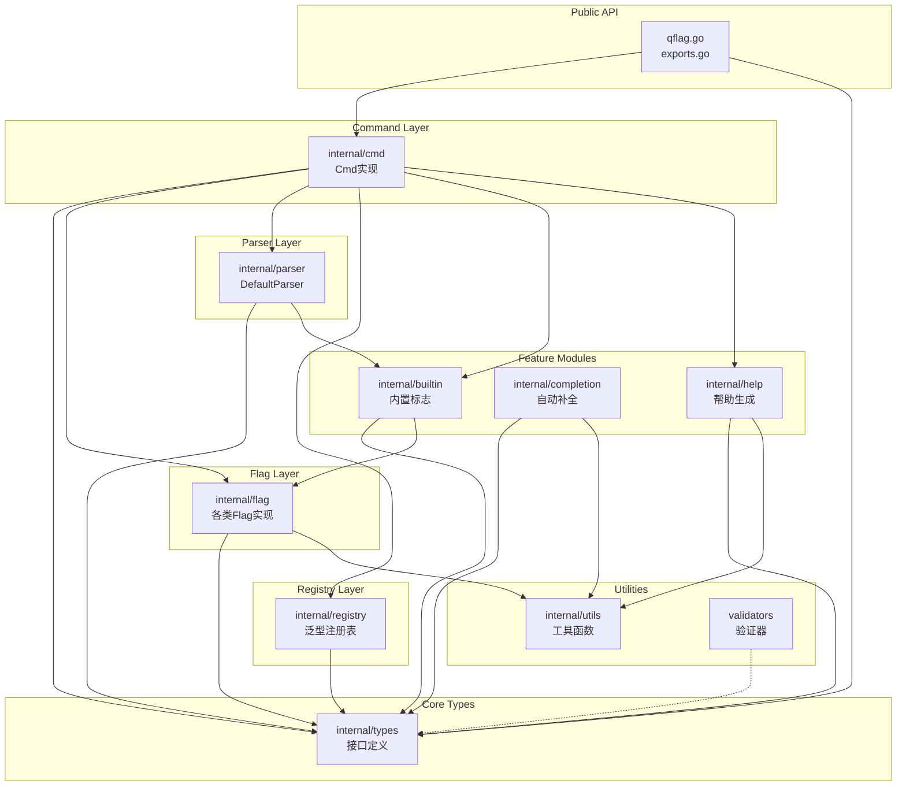

# QFlag 项目分析报告

> **分析日期**: 2026-03-25  
> **分析版本**: 稳定发布版本  
> **技术栈**: Go 1.24+

---

## 一、目录结构梳理

### 1.1 根目录结构

```
qflag/
├── README.md                 # 项目介绍和使用文档
├── LICENSE                   # MIT 许可证
├── go.mod                    # Go 模块定义 (Go 1.24.0)
├── APIDOC.md                 # API 文档
├── FLAG_USAGE.md             # 标志使用指南
├── qflag.go                  # 全局根命令入口
├── exports.go                # 公共接口和类型导出
├── parser_test.go            # 解析器测试
├── completion_test.go        # 自动补全测试
├── qflag_test.go             # 主包测试
│
├── docs/                     # 设计文档目录
│   ├── IMPLEMENTATION_PLAN.md
│   ├── REFACTOR_PLAN.md
│   ├── BUILTIN_FLAGS_DESIGN.md
│   ├── COMPLETION_DESIGN.md
│   ├── VALIDATOR_DESIGN.md
│   └── ... (共 20+ 设计文档)
│
├── examples/                 # 示例代码目录
│   ├── builtin-flags/        # 内置标志示例
│   ├── cmdopts/              # 命令选项示例
│   ├── mutex-group/          # 互斥组示例
│   ├── nested-commands/      # 嵌套子命令示例
│   ├── required-groups/      # 必需组示例
│   └── flag-constructors/    # 标志构造器示例
│
├── internal/                 # 内部实现目录
│   ├── types/                # 核心类型定义
│   ├── cmd/                  # 命令实现
│   ├── flag/                 # 标志实现
│   ├── parser/               # 解析器实现
│   ├── registry/             # 注册表实现
│   ├── builtin/              # 内置标志管理
│   ├── completion/           # 自动补全实现
│   ├── help/                 # 帮助生成器
│   ├── utils/                # 工具函数
│   └── mock/                 # 测试模拟对象
│
├── validators/               # 验证器包 (公共)
│   ├── validators.go         # 验证器实现
│   └── validators_test.go    # 验证器测试
│
└── completion_test.go        # 自动补全测试
```

### 1.2 目录规范评估

| 目录 | 用途 | 规范程度 |
|------|------|----------|
| `internal/` | 内部实现，遵循 Go 标准项目结构 | ✅ 优秀 |
| `examples/` | 示例代码，按功能分类 | ✅ 优秀 |
| `docs/` | 设计文档，命名规范 | ✅ 优秀 |
| `validators/` | 公共验证器，独立成包 | ✅ 合理 |

**总体评价**: 目录结构遵循 Go 项目最佳实践，清晰分层，职责明确。

---

## 二、核心功能模块识别

### 2.1 模块总览

| 模块名称 | 核心功能 | 对应代码路径 | 模块类型 |
|----------|----------|--------------|----------|
| **类型系统** | 定义核心接口和类型 | `internal/types/` | 基础支撑 |
| **标志系统** | 实现各类标志类型 | `internal/flag/` | 业务核心 |
| **命令系统** | 命令管理和生命周期 | `internal/cmd/` | 业务核心 |
| **解析系统** | 参数解析和路由 | `internal/parser/` | 业务核心 |
| **注册表系统** | 标志和命令的存储管理 | `internal/registry/` | 基础支撑 |
| **内置标志** | 帮助、版本、补全标志 | `internal/builtin/` | 业务核心 |
| **自动补全** | Shell 补全脚本生成 | `internal/completion/` | 业务核心 |
| **帮助生成** | 帮助文档自动生成 | `internal/help/` | 业务核心 |
| **验证器** | 标志值验证 | `validators/` | 基础支撑 |
| **工具函数** | 通用工具函数 | `internal/utils/` | 基础支撑 |

### 2.2 标志类型支持

```go
// 基础类型
FlagTypeString, FlagTypeBool, FlagTypeInt, FlagTypeInt64
FlagTypeUint, FlagTypeUint8, FlagTypeUint16, FlagTypeUint32, FlagTypeUint64
FlagTypeFloat64

// 特殊类型
FlagTypeEnum          // 枚举类型

// 时间/大小类型
FlagTypeDuration      // 持续时间 (如 1h30m)
FlagTypeTime          // 时间点
FlagTypeSize          // 存储大小 (如 1KB, 2MB)

// 集合类型
FlagTypeMap           // 键值对映射
FlagTypeStringSlice   // 字符串切片
FlagTypeIntSlice      // 整数切片
FlagTypeInt64Slice    // 64位整数切片
```

### 2.3 核心输入/输出

| 模块 | 核心输入 | 核心输出 | 依赖资源 |
|------|----------|----------|----------|
| Parser | `os.Args[]`, 环境变量 | 解析后的标志值 | FlagRegistry, CmdRegistry |
| Flag | 字符串值 | 类型化值 | 无 |
| Command | 用户配置 | 可执行命令 | FlagRegistry, CmdRegistry, Parser |
| Completion | Command 树 | Shell 脚本 | 模板文件 |
| Help | Command 配置 | 帮助文本 | 国际化配置 |

---

## 三、模块间依赖关系分析

### 3.1 依赖关系图 (Mermaid)



### 3.2 依赖关系说明

1. **层级依赖** (从上到下):
   - `types` 是最底层，被所有模块依赖
   - `registry` 和 `utils` 是基础支撑层
   - `flag` 和 `parser` 是核心实现层
   - `cmd` 是业务逻辑层
   - `builtin`, `completion`, `help` 是功能扩展层

2. **关键依赖路径**:
   - 命令创建: `Cmd` → `FlagRegistry` + `CmdRegistry` + `Parser`
   - 参数解析: `Parser` → `FlagSet` (标准库) + `BuiltinFlagManager`
   - 帮助生成: `Help` → `Cmd` + `Utils`

3. **依赖健康度评估**:
   - ✅ 无循环依赖
   - ✅ 依赖方向一致（从上到下）
   - ✅ 接口隔离良好（通过 `types` 包定义接口）
   - ⚠️ `cmd` 包依赖较多，但符合其职责定位

---

## 四、设计模式与实现逻辑

### 4.1 设计模式识别

| 设计模式 | 应用场景 | 代码位置 |
|----------|----------|----------|
| **单例模式** | 全局根命令 `Root` | `qflag.go:Root` |
| **工厂模式** | 标志创建函数 | `cmd/cmd.go:String()`, `Int()`, `Bool()`... |
| **策略模式** | 错误处理策略 | `types.ErrorHandling` |
| **模板方法** | 标志基类 + 具体实现 | `flag.BaseFlag` + `StringFlag`/`IntFlag`... |
| **注册表模式** | 标志和命令管理 | `registry.FlagRegistryImpl` |
| **命令模式** | 子命令执行 | `cmd.Cmd.Run()` |
| **观察者模式** | 内置标志处理 | `builtin.BuiltinFlagManager` |
| **外观模式** | 全局便捷函数 | `qflag.Parse()`, `AddSubCmds()`... |

### 4.2 泛型设计详解

项目大量使用 Go 泛型实现类型安全:

```go
// 泛型基础标志
 type BaseFlag[T any] struct {
     value     *T
     default_  T
     validator types.Validator[T]
     // ...
 }

// 泛型验证器
 type Validator[T any] func(value T) error

// 泛型注册表
 type registry[T any] struct {
     items     map[int]T
     nameIndex map[string]int
 }
```

### 4.3 核心流程实现

#### 4.3.1 参数解析流程

```
Parse(args)
    ↓
ParseOnly(cmd, args)
    ↓
1. 创建 FlagSet
2. 重置所有标志到默认状态
3. 注册内置标志 (help, version, completion)
    ↓
4. 注册用户定义标志到 FlagSet
5. 解析命令行参数 (flagSet.Parse)
    ↓
6. 加载环境变量 (如果标志未被设置)
    ↓
7. 验证互斥组和必需组
    ↓
8. 处理内置标志
    ↓
返回解析结果
```

#### 4.3.2 子命令路由流程

```
ParseAndRoute(args)
    ↓
ParseOnly(args)  // 解析当前命令参数
    ↓
检查剩余参数
    ↓
如果是子命令名称 → 递归调用 subCmd.ParseAndRoute()
如果不是子命令 → 执行当前命令的 Run()
```

### 4.4 并发安全设计

```go
// Cmd 使用读写锁保护
 type Cmd struct {
     mu sync.RWMutex
     // ... 所有字段
 }

// BaseFlag 使用读写锁保护
 type BaseFlag[T any] struct {
     mu sync.RWMutex
     // ... 可变字段
 }

// 读操作使用 RLock()
// 写操作使用 Lock()
```

---

## 五、技术栈评估

### 5.1 核心技术栈

| 技术组件 | 版本/说明 | 评估 |
|----------|-----------|------|
| Go | 1.24.0 | ✅ 最新稳定版，支持泛型 |
| 标准库 `flag` | 内置 | ✅ 作为底层解析基础 |
| 标准库 `sync` | 内置 | ✅ 并发控制 |
| `embed` | 内置 | ✅ 嵌入补全模板 |
| 测试框架 | `testing` | ✅ 标准测试 |

### 5.2 技术选型分析

**优势**:
1. **零外部依赖**: 仅依赖 Go 标准库，降低维护成本
2. **泛型支持**: 充分利用 Go 1.18+ 泛型特性，实现类型安全
3. **标准库兼容**: 基于 `flag.FlagSet`，与标准库行为一致

**潜在考虑**:
1. Go 1.24 要求较新，可能限制旧环境使用
2. 纯标准库实现，某些高级功能需自行实现

### 5.3 版本兼容性

```go
// go.mod
module gitee.com/MM-Q/qflag
go 1.24.0  // 最低要求
```

---

## 六、补充分析

### 6.1 代码规范

| 规范项 | 评估 | 说明 |
|--------|------|------|
| 命名规范 | ✅ 优秀 | 遵循 Go 命名约定，长名称/短名称区分清晰 |
| 注释规范 | ✅ 优秀 | 每个导出函数都有完整文档注释 |
| 代码风格 | ✅ 优秀 | 使用 `gofmt` 标准格式 |
| 接口设计 | ✅ 优秀 | 接口粒度适中，职责单一 |

### 6.2 异常处理

```go
// 结构化错误类型
 type Error struct {
     Code    string
     Message string
     Cause   error
 }

// 支持错误链
 func (e *Error) Unwrap() error { return e.Cause }

// 预定义错误码
 var (
     ErrFlagNotFound      = NewError("FLAG_NOT_FOUND", ...)
     ErrCmdNotFound       = NewError("COMMAND_NOT_FOUND", ...)
     ErrValidationFailed  = NewError("VALIDATION_FAILED", ...)
     // ...
 )
```

**评估**: ✅ 完善的错误处理机制，支持错误分类和链式追踪

### 6.3 扩展性分析

| 扩展点 | 实现方式 | 评估 |
|--------|----------|------|
| 自定义标志类型 | 实现 `types.Flag` 接口 | ✅ 良好 |
| 自定义验证器 | `Validator[T]` 函数类型 | ✅ 优秀 |
| 自定义帮助格式 | 修改 `help/gen.go` | ⚠️ 需修改源码 |
| 自定义内置标志 | 实现 `types.BuiltinFlagHandler` | ✅ 良好 |

### 6.4 性能关键点

| 关注点 | 实现 | 评估 |
|--------|------|------|
| 锁粒度 | 每个 Cmd/Flag 独立锁 | ✅ 避免全局锁 |
| 解析缓存 | 使用 `sync.Once` 确保单次解析 | ✅ 正确 |
| 内存分配 | 泛型减少类型断言 | ✅ 高效 |
| 注册表查找 | map 索引 O(1) | ✅ 高效 |

---

## 七、项目核心特点

### 7.1 架构亮点

1. **泛型驱动**: 充分利用 Go 泛型实现类型安全的标志系统
2. **零依赖**: 纯标准库实现，无第三方依赖
3. **并发安全**: 全链路读写锁保护
4. **模块化设计**: 清晰的模块边界和职责分离
5. **标准兼容**: 基于 `flag.FlagSet`，行为与标准库一致

### 7.2 功能亮点

1. **丰富的标志类型**: 15+ 种标志类型，覆盖常见场景
2. **子命令支持**: 完整的嵌套子命令体系
3. **自动补全**: 支持 Bash 和 PowerShell
4. **验证器系统**: 灵活的泛型验证器
5. **互斥/必需组**: 复杂的标志依赖关系验证
6. **国际化**: 中英文双语支持

---

## 八、待优化点

| 优先级 | 优化项 | 建议 |
|--------|--------|------|
| 低 | 帮助生成器扩展性 | 提供接口允许自定义帮助格式 |
| 低 | 更多 Shell 支持 | 增加 Zsh、Fish 补全支持 |
| 低 | 配置文件支持 | 增加 YAML/JSON 配置文件解析 |
| 低 | 性能基准测试 | 添加 Benchmark 测试 |

---

## 九、关键记忆点

### 9.1 快速索引

| 查询需求 | 定位位置 |
|----------|----------|
| 标志类型定义 | `internal/types/flag.go:FlagType` |
| 命令接口定义 | `internal/types/command.go:Command` |
| 全局根命令 | `qflag.go:Root` |
| 标志基类 | `internal/flag/base_flag.go:BaseFlag` |
| 解析器实现 | `internal/parser/parser.go:DefaultParser` |
| 验证器库 | `validators/validators.go` |
| 内置标志处理 | `internal/builtin/manager.go` |
| 帮助生成 | `internal/help/gen.go` |

### 9.2 核心类图记忆

```
                    Command (interface)
                         ↑
                    Cmd (struct)
                         |
    ┌────────────────────┼────────────────────┐
    |                    |                    |
FlagRegistry      CmdRegistry            Parser
    |                    |                    |
    └────────────────────┴────────────────────┘
                         |
                    Flags (BaseFlag[T])
```

### 9.3 使用模式记忆

```go
// 模式1: 全局根命令 (推荐)
name := qflag.Root.String("name", "n", "用户名", "guest")
qflag.Parse()

// 模式2: 创建子命令
sub := qflag.NewCmd("sub", "s", qflag.ExitOnError)
qflag.Root.AddSubCmds(sub)

// 模式3: 添加验证器
port := qflag.Root.Int("port", "p", "端口", 8080)
port.SetValidator(validators.IntRange(1, 65535))
```

---

## 十、总结

**QFlag** 是一个设计精良、功能完善的 Go 语言命令行参数解析库。其核心优势在于：

1. **现代化设计**: 充分利用 Go 泛型，实现类型安全
2. **功能完备**: 支持子命令、验证、补全、国际化等高级特性
3. **零依赖**: 纯标准库实现，易于集成和维护
4. **并发安全**: 全链路锁保护，支持并发访问
5. **文档完善**: 20+ 设计文档，代码注释详尽

项目已达到稳定发布状态，代码质量高，架构清晰，适合作为命令行工具的基础库使用。

---

**已完成项目记忆建立，后续可基于此回答项目相关问题。**
