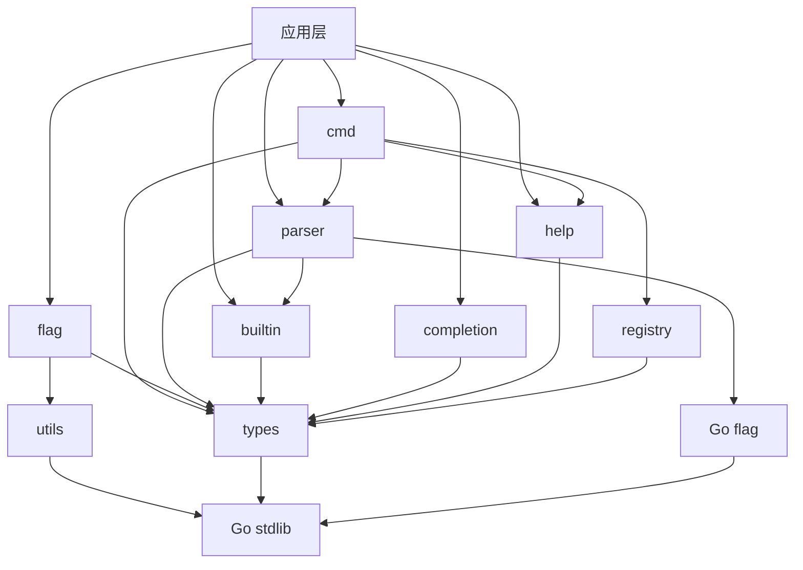

# QFlag 项目分析报告

## 一、项目概述

QFlag 是一个专为 Go 语言设计的命令行参数解析库，提供了丰富的功能和优雅的 API，帮助开发者快速构建专业的命令行工具。该项目采用模块化设计，支持多种标志类型、子命令、环境变量绑定、自动补全等高级特性，同时保持简单易用的设计理念。

### 项目基本信息
- **项目名称**: QFlag
- **技术栈**: Go 1.24.0
- **项目地址**: 
  - Gitee: https://gitee.com/MM-Q/qflag
  - GitHub: https://github.com/QiaoMuDe/qflag
- **许可证**: MIT
- **核心特性**: 泛型设计、自动路由、类型安全、并发安全、自动补全、子命令管理

## 二、目录结构梳理

### 2.1 项目根目录结构

```
qflag/
├── internal/              # 内部实现目录
│   ├── builtin/          # 内置标志 (help, version, completion) 
│   ├── cmd/             # 命令实现
│   ├── completion/      # 自动补全脚本生成
│   ├── flag/            # 标志类型实现
│   ├── parser/          # 参数解析器
│   ├── registry/        # 注册表实现
│   ├── types/           # 类型定义
│   ├── utils/           # 工具函数
│   ├── help/            # 帮助信息生成
│   └── mock/            # 测试模拟对象
├── examples/            # 使用示例
│   ├── builtin-flags/    # 内置标志示例
│   ├── cmdopts/         # 命令选项示例
│   ├── cmdspec/         # 命令规格示例
│   ├── flag-constructors/ # 标志构造器示例
│   ├── mutex-group/     # 互斥组示例
│   └── nested-commands/ # 嵌套命令示例
├── validators/          # 验证器实现
├── docs/               # 设计文档
├── exports.go          # 公共 API 导出
├── qflag.go           # 全局根命令和便捷函数
├── go.mod             # Go 模块文件
├── go.sum             # 依赖校验文件
├── README.md          # 项目文档
├── LICENSE            # 许可证文件
└── APIDOC.md          # API 文档
```

### 2.2 目录功能说明

#### 核心模块目录
- **internal/types/**: 核心类型定义，包括接口、错误类型、配置结构等，是整个项目的基础抽象层
- **internal/cmd/**: 命令实现，提供完整的命令行命令功能，支持标志管理、子命令、参数解析和执行
- **internal/flag/**: 标志类型实现，包括基础标志、数值标志、集合标志、特殊标志等
- **internal/parser/**: 参数解析器，负责解析命令行参数、处理环境变量和路由子命令
- **internal/registry/**: 注册表实现，基于泛型的通用注册表，支持标志和命令的注册与查找

#### 辅助功能目录
- **internal/builtin/**: 内置标志处理，包括帮助、版本、补全等内置功能
- **internal/completion/**: 自动补全脚本生成，支持 Bash 和 PowerShell
- **internal/help/**: 帮助信息生成器
- **internal/utils/**: 工具函数集合
- **internal/mock/**: 测试模拟对象，用于单元测试

#### 文档与示例目录
- **examples/**: 使用示例，展示各种功能的使用方法
- **docs/**: 设计文档，记录各种设计决策和实现方案
- **validators/**: 验证器实现，提供标志值验证功能

### 2.3 关键文件说明

- **qflag.go**: 全局根命令和便捷函数，提供简单的 API 入口
- **exports.go**: 公共 API 导出，将内部实现导出为公共接口
- **go.mod**: Go 模块文件，定义模块路径和 Go 版本
- **README.md**: 项目文档，包含安装、使用和 API 说明

## 三、核心功能模块识别

### 3.1 基础支撑模块

#### 1. 类型定义模块 (internal/types)
- **核心功能**: 定义项目中的核心接口和类型
- **对应文件**: command.go, flag.go, parser.go, registry.go, error.go, config.go
- **核心输入/输出**: 接口定义、错误类型、配置结构
- **核心依赖**: Go 标准库

#### 2. 注册表模块 (internal/registry)
- **核心功能**: 提供标志和命令的注册与查找功能
- **对应文件**: impl.go, flag_registry.go, command_registry.go
- **核心输入/输出**: 注册项、查找结果
- **核心依赖**: types 模块

#### 3. 工具函数模块 (internal/utils)
- **核心功能**: 提供通用工具函数
- **对应文件**: utils.go
- **核心输入/输出**: 工具函数
- **核心依赖**: Go 标准库

### 3.2 业务核心模块

#### 1. 标志管理模块 (internal/flag)
- **核心功能**: 实现各种类型的标志，支持值设置、验证和环境变量绑定
- **对应文件**: base_flag.go, basic_flags.go, numeric_flags.go, collection_flags.go, special_flags.go, time_size_flags.go
- **核心输入/输出**: 标志实例、标志值
- **核心依赖**: types 模块、utils 模块

#### 2. 命令管理模块 (internal/cmd)
- **核心功能**: 实现命令结构体，支持标志管理、子命令、参数解析和执行
- **对应文件**: cmd.go, cmdspec.go, cmdopts.go, flag.go
- **核心输入/输出**: 命令实例、执行结果
- **核心依赖**: types 模块、registry 模块、parser 模块、help 模块

#### 3. 参数解析模块 (internal/parser)
- **核心功能**: 解析命令行参数，处理环境变量，路由子命令
- **对应文件**: parser.go, parser_env.go, parser_register.go, parser_validation.go
- **核心输入/输出**: 解析结果、错误信息
- **核心依赖**: types 模块、builtin 模块、Go 标准库 flag 包

#### 4. 内置功能模块 (internal/builtin)
- **核心功能**: 实现内置标志处理，包括帮助、版本、补全等功能
- **对应文件**: manager.go, help_handlers.go, version_handlers.go, completion_handler.go
- **核心输入/输出**: 内置标志处理结果
- **核心依赖**: types 模块

#### 5. 自动补全模块 (internal/completion)
- **核心功能**: 生成 Bash 和 PowerShell 补全脚本
- **对应文件**: completion.go, bash_completion.go, pwsh_completion.go
- **核心输入/输出**: 补全脚本
- **核心依赖**: types 模块

#### 6. 帮助生成模块 (internal/help)
- **核心功能**: 生成命令帮助信息
- **对应文件**: gen.go
- **核心输入/输出**: 帮助文本
- **核心依赖**: types 模块

## 四、模块间依赖关系分析

### 4.1 依赖层次结构

```
应用层 (examples/, qflag.go, exports.go)
    ↓
业务逻辑层 (cmd/, flag/, parser/, builtin/, completion/, help/)
    ↓
抽象接口层 (types/)
    ↓
基础工具层 (utils/, registry/)
    ↓
系统层 (Go 标准库)
```

### 4.2 核心依赖关系

1. **types 模块** 是整个项目的基础，被所有其他模块依赖
2. **cmd 模块** 依赖 types、registry、parser、help 模块
3. **parser 模块** 依赖 types、builtin 模块和 Go 标准库 flag 包
4. **flag 模块** 依赖 types、utils 模块
5. **registry 模块** 依赖 types 模块
6. **builtin 模块** 依赖 types 模块
7. **completion 模块** 依赖 types 模块
8. **help 模块** 依赖 types 模块

### 4.3 依赖关系图



### 4.4 潜在问题分析

1. **循环依赖**: 项目中没有发现循环依赖问题，依赖关系清晰
2. **过度依赖**: types 模块被所有其他模块依赖，符合其作为基础抽象层的定位
3. **依赖缺失**: 没有发现明显的依赖缺失问题

## 五、设计模式与实现逻辑

### 5.1 使用的设计模式

#### 1. 泛型模式 (Generic Pattern)
- **应用位置**: internal/flag/base_flag.go, internal/registry/impl.go
- **应用场景**: 使用 Go 泛型实现类型安全的标志和注册表
- **代码示例**:
```go
type BaseFlag[T any] struct {
    mu        sync.RWMutex
    value     *T
    default_  T
    // ...
}

type registry[T any] struct {
    items     map[int]T
    nameIndex map[string]int
    // ...
}
```

#### 2. 接口隔离模式 (Interface Segregation Pattern)
- **应用位置**: internal/types/ 目录下的所有接口定义
- **应用场景**: 定义细粒度的接口，实现接口隔离
- **代码示例**:
```go
type Flag interface {
    Name() string
    LongName() string
    ShortName() string
    // ...
}

type Command interface {
    Name() string
    AddFlag(flag Flag) error
    // ...
}
```

#### 3. 注册表模式 (Registry Pattern)
- **应用位置**: internal/registry/ 目录
- **应用场景**: 实现标志和命令的注册与查找
- **代码示例**:
```go
type FlagRegistry interface {
    Register(flag Flag, longName, shortName string) error
    Get(name string) (Flag, bool)
    List() []Flag
    // ...
}
```

#### 4. 策略模式 (Strategy Pattern)
- **应用位置**: internal/parser/parser.go
- **应用场景**: 实现不同的错误处理策略
- **代码示例**:
```go
type ErrorHandling = flag.ErrorHandling

const (
    ContinueOnError ErrorHandling = flag.ContinueOnError
    ExitOnError    ErrorHandling = flag.ExitOnError
    PanicOnError   ErrorHandling = flag.PanicOnError
)
```

#### 5. 工厂模式 (Factory Pattern)
- **应用位置**: 各种标志和命令的构造函数
- **应用场景**: 创建不同类型的标志和命令实例
- **代码示例**:
```go
func NewCmd(longName, shortName string, errorHandling types.ErrorHandling) *Cmd {
    return &Cmd{
        longName:     longName,
        shortName:    shortName,
        config:       types.NewCmdConfig(),
        flagRegistry: registry.NewFlagRegistry(),
        // ...
    }
}
```

#### 6. 模板方法模式 (Template Method Pattern)
- **应用位置**: internal/flag/base_flag.go
- **应用场景**: 定义标志的基础行为模板
- **代码示例**:
```go
func (f *BaseFlag[T]) Set(value string) error {
    // 模板方法，定义设置值的基本流程
    parsedValue, err := f.parseValue(value)
    if err != nil {
        return err
    }
    
    if f.validator != nil {
        if err := f.validator(parsedValue); err != nil {
            return err
        }
    }
    
    f.setValue(parsedValue)
    f.isSet = true
    return nil
}
```

### 5.2 核心业务逻辑实现

#### 1. 命令解析流程
```
接收命令行参数 → 解析参数 → 验证参数 → 路由到子命令 → 执行命令 → 返回结果
```

#### 2. 标志设置流程
```
接收字符串值 → 类型转换 → 值验证 → 设置值 → 更新状态
```

#### 3. 子命令路由流程
```
解析参数 → 识别子命令 → 获取子命令实例 → 递归解析 → 执行子命令
```

### 5.3 代码质量分析

1. **代码清晰度**: 代码结构清晰，职责分明，易于理解
2. **冗余代码**: 没有发现明显的代码冗余
3. **硬编码问题**: 没有发现明显的硬编码问题，使用了常量定义和配置结构

## 六、技术栈评估

### 6.1 核心技术栈

- **编程语言**: Go 1.24.0
- **核心依赖**: Go 标准库 (flag, fmt, sync, errors 等)
- **设计特性**: 泛型、接口、并发安全

### 6.2 技术选择适配性

1. **Go 语言**: 适合开发命令行工具，编译型语言，部署简单，性能优秀
2. **泛型特性**: Go 1.24.0 的泛型特性非常适合实现类型安全的标志和注册表
3. **标准库 flag 包**: 作为解析基础，提供了稳定可靠的命令行参数解析能力

### 6.3 版本兼容性

- **Go 版本**: 使用 Go 1.24.0，这是较新的版本，支持泛型特性
- **依赖项**: 主要依赖 Go 标准库，没有外部依赖，版本兼容性好

### 6.4 技术社区活跃度

- **Go 语言**: 活跃度高，持续更新，社区支持良好
- **标准库**: 随 Go 语言一起维护，稳定可靠

## 七、补充分析项

### 7.1 代码规范

1. **命名规范**: 遵循 Go 语言命名规范，使用驼峰命名法
2. **注释规范**: 提供了详细的函数和类型注释，符合 Go 语言文档规范
3. **代码风格**: 遵循 Go 官方代码风格，使用 gofmt 格式化

### 7.2 异常处理

1. **错误处理**: 使用结构化错误类型，提供错误码、错误消息和原始错误
2. **错误链**: 支持 errors.Unwrap 和 errors.Is，便于错误处理
3. **错误策略**: 提供多种错误处理策略（ContinueOnError、ExitOnError、PanicOnError）

### 7.3 扩展性

1. **接口设计**: 基于接口的设计便于扩展和替换实现
2. **泛型支持**: 使用泛型提高类型安全性和代码复用
3. **插件化**: 支持自定义验证器、标志类型等

### 7.4 性能关键点

1. **并发安全**: 使用读写锁保证并发安全，性能良好
2. **内存效率**: 使用指针和值类型结合，减少内存分配
3. **解析效率**: 基于标准库 flag 包，解析效率高

## 八、项目核心特点

1. **泛型设计**: 充分利用 Go 1.24.0 的泛型特性，实现类型安全的标志和注册表
2. **模块化架构**: 清晰的模块划分，职责分明，易于维护和扩展
3. **丰富的功能**: 支持多种标志类型、子命令、环境变量绑定、自动补全等高级特性
4. **并发安全**: 使用读写锁保证并发安全，适合多线程环境
5. **简单易用**: 提供全局根命令和便捷函数，简化使用方式

## 九、待优化点

1. **文档完善**: 可以进一步完善 API 文档和使用示例
2. **性能优化**: 可以考虑对标志查找和注册表操作进行性能优化
3. **功能扩展**: 可以考虑添加更多标志类型和验证器
4. **测试覆盖**: 可以进一步提高测试覆盖率，特别是边界条件测试

## 十、关键记忆点

1. **全局根命令**: qflag.Root 是最简单的使用方式，推荐优先使用
2. **泛型标志**: BaseFlag[T] 是所有标志类型的基础，使用泛型实现类型安全
3. **注册表模式**: registry[T] 是泛型注册表实现，支持高效的名称查找
4. **错误处理**: 使用结构化错误类型，支持错误码、错误消息和原始错误
5. **并发安全**: 所有公共操作都使用读写锁保护，确保并发安全

---

**分析完成时间**: 2026-03-04  
**分析人员**: 资深技术架构师  
**项目版本**: 基于当前代码库状态