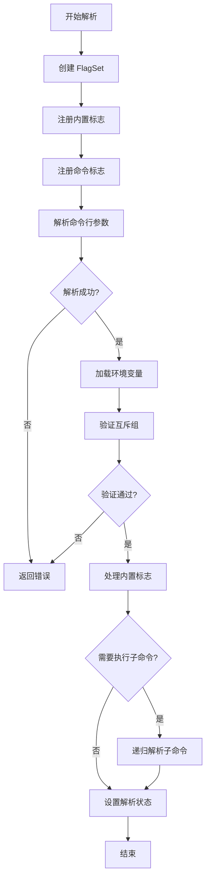
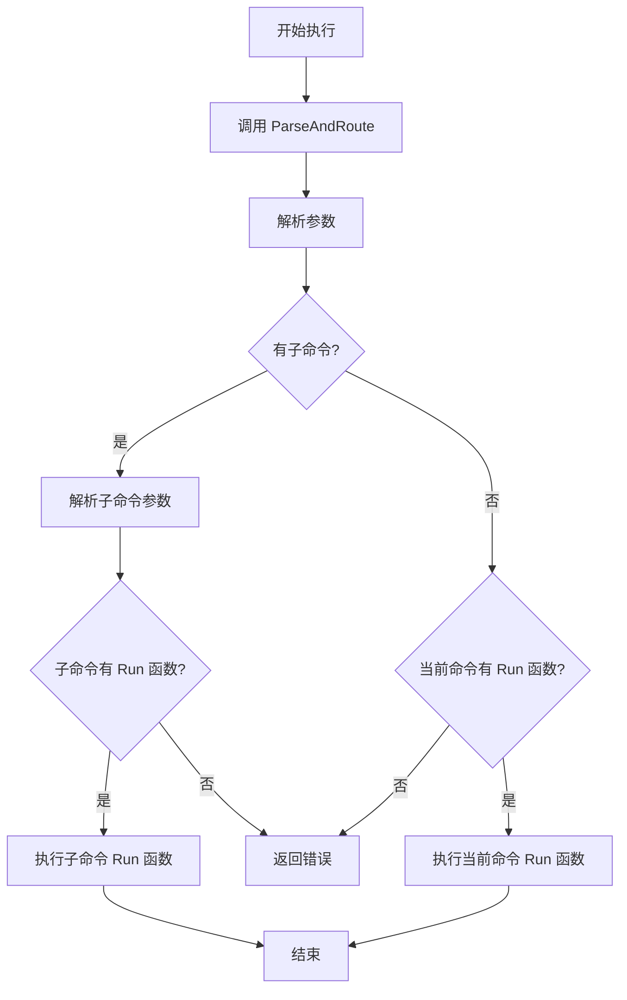
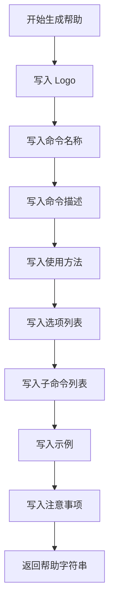
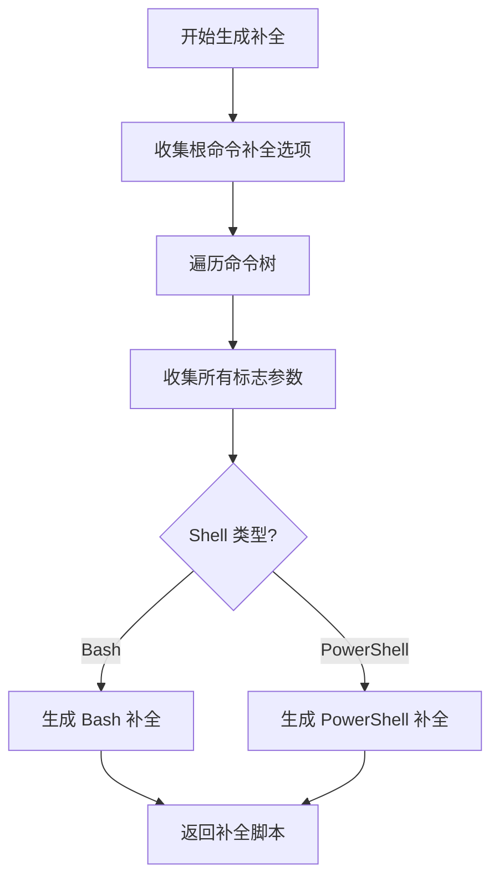

# QFlag 项目分析报告

## 一、项目概述

### 1.1 项目基本信息

| 属性 | 值 |
|------|-----|
| **项目名称** | QFlag |
| **项目类型** | Go 语言命令行参数解析库 |
| **模块路径** | `gitee.com/MM-Q/qflag` |
| **Go 版本要求** | 1.24.0+ |
| **许可证** | MIT |
| **代码仓库** | Gitee / GitHub 双平台托管 |

### 1.2 项目定位

QFlag 是一个专为 Go 语言设计的现代化命令行参数解析库，提供类型安全、高性能、易用的 API，支持丰富的标志类型、子命令管理、环境变量绑定、自动补全等高级特性。

### 1.3 核心特性

- **类型安全**：支持多种标志类型，确保类型安全
- **高性能**：优化的解析算法，快速高效
- **错误处理**：结构化的错误类型，便于调试和处理
- **国际化**：支持中文和英文双语
- **环境变量**：自动绑定环境变量
- **自动补全**：生成 Bash 和 PowerShell 补全脚本
- **帮助生成**：自动生成专业的帮助文档
- **互斥标志**：支持标志互斥组
- **子命令**：完整的子命令支持

---

## 二、目录结构分析

### 2.1 完整目录结构

```
qflag/
├── internal/                          # 内部实现包（不对外暴露）
│   ├── builtin/                       # 内置标志管理
│   │   ├── manager.go                 # 内置标志管理器
│   │   ├── help_handlers.go           # 帮助标志处理器
│   │   ├── version_handlers.go        # 版本标志处理器
│   │   ├── completion_handler.go      # 补全标志处理器
│   │   ├── builtin_test.go            # 内置标志测试
│   │   └── APIDOC.md                  # API 文档
│   ├── cmd/                           # 命令实现
│   │   ├── cmd.go                     # 命令核心实现（1138行）
│   │   ├── cmdspec.go                 # 命令规格创建
│   │   ├── cmdopts.go                 # 命令选项配置
│   │   ├── flag.go                    # 命令便捷方法
│   │   ├── cmd_test.go                # 命令测试
│   │   ├── cmdspec_test.go            # 命令规格测试
│   │   ├── cmdopts_test.go            # 命令选项测试
│   │   └── mutex_group_test.go        # 互斥组测试
│   ├── completion/                    # 自动补全脚本生成
│   │   ├── completion.go              # 补全核心逻辑（393行）
│   │   ├── bash_completion.go         # Bash 补全实现
│   │   ├── pwsh_completion.go         # PowerShell 补全实现
│   │   ├── templates/                 # 补全脚本模板
│   │   │   ├── bash.tmpl              # Bash 模板
│   │   │   └── pwsh.tmpl              # PowerShell 模板
│   │   └── APIDOC.md                  # API 文档
│   ├── flag/                          # 标志类型实现
│   │   ├── base_flag.go               # 泛型基础标志（264行）
│   │   ├── basic_flags.go             # 基础类型标志
│   │   ├── numeric_flags.go            # 数值类型标志
│   │   ├── collection_flags.go        # 集合类型标志
│   │   ├── time_size_flags.go          # 时间和大小类型标志
│   │   ├── special_flags.go            # 特殊类型标志（枚举）
│   │   ├── *_test.go                  # 各类型标志测试
│   │   └── APIDOC.md                  # API 文档
│   ├── help/                          # 帮助信息生成
│   │   ├── gen.go                     # 帮助生成器（262行）
│   │   └── APIDOC.md                  # API 文档
│   ├── parser/                        # 参数解析器
│   │   ├── parser.go                  # 解析器核心（185行）
│   │   ├── parser_register.go         # 标志注册
│   │   ├── parser_env.go              # 环境变量加载
│   │   ├── parser_validation.go       # 验证逻辑
│   │   └── APIDOC.md                  # API 文档
│   ├── registry/                      # 注册表实现
│   │   ├── impl.go                    # 泛型注册表（248行）
│   │   ├── flag_registry.go           # 标志注册表
│   │   ├── command_registry.go        # 命令注册表
│   │   ├── registry_test.go           # 注册表测试
│   │   ├── REDESIGN.md                # 重构设计文档
│   │   └── APIDOC.md                  # API 文档
│   ├── types/                         # 类型定义和接口
│   │   ├── command.go                 # 命令接口定义
│   │   ├── flag.go                    # 标志接口定义（364行）
│   │   ├── config.go                  # 配置类型定义
│   │   ├── error.go                   # 错误类型定义
│   │   ├── parser.go                  # 解析器接口定义
│   │   ├── registry.go                # 注册表接口定义
│   │   ├── builtin.go                 # 内置标志类型
│   │   ├── storage.go                 # 存储接口
│   │   ├── help.go                    # 帮助相关常量
│   │   ├── time_formats.go             # 时间格式定义
│   │   └── APIDOC.md                  # API 文档
│   ├── utils/                         # 工具函数
│   │   ├── utils.go                   # 通用工具函数
│   │   ├── utils_test.go              # 工具函数测试
│   │   └── APIDOC.md                  # API 文档
│   └── mock/                          # 测试辅助工具
│       ├── mock_cmd.go                # 命令模拟
│       ├── mock_flag.go               # 标志模拟
│       ├── mock_parser.go             # 解析器模拟
│       ├── mock_registry.go           # 注册表模拟
│       ├── test_helper.go             # 测试辅助函数
│       ├── example_test.go            # 示例测试
│       └── README.md                  # Mock 使用说明
├── examples/                          # 使用示例
│   ├── builtin-flags/                 # 内置标志示例
│   ├── cmdopts/                       # 命令选项示例
│   ├── cmdspec/                       # 命令规格示例
│   ├── flag-constructors/            # 标志构造器示例
│   └── mutex-group/                  # 互斥组示例
├── docs/                              # 设计文档
│   ├── BUILTIN_FLAGS_DESIGN.md        # 内置标志设计
│   ├── CMD_OPTS_DESIGN.md             # 命令选项设计
│   ├── COMPLETION_DESIGN.md           # 补全功能设计
│   ├── FLAG_CREATION_SIMPLIFICATION.md # 标志创建简化
│   ├── HELP_GENERATOR_DESIGN.md       # 帮助生成器设计
│   ├── IMPLEMENTATION_PLAN.md          # 实现计划
│   ├── LOCK_REFACTOR_PLAN.md          # 锁重构计划
│   ├── REFACTOR_PLAN.md                # 重构计划
│   ├── UNIVERSAL_COMPLETION_DESIGN.md  # 通用补全设计
│   ├── command-description-design.md   # 命令描述设计
│   ├── flag_type_implementation_status.md # 标志类型实现状态
│   ├── flagspec-design.md              # 标志规格设计
│   ├── generic_validator_design.md     # 泛型验证器设计
│   └── mutex-group-design.md          # 互斥组设计
├── exports.go                         # 公共 API 导出（602行）
├── qflag.go                           # 全局根命令和便捷函数（133行）
├── qflag_test.go                      # 全局功能测试
├── parser_test.go                     # 解析器测试
├── completion_test.go                # 补全功能测试
├── go.mod                             # Go 模块文件
├── go.sum                             # 依赖锁定文件
├── README.md                          # 项目说明文档（609行）
├── LICENSE                            # MIT 许可证
├── APIDOC.md                          # API 文档
└── .gitignore                         # Git 忽略配置
```

### 2.2 目录结构评估

#### 优点
1. **清晰的分层架构**：`internal/` 目录严格隔离内部实现，符合 Go 语言最佳实践
2. **模块化设计**：各功能模块职责明确，耦合度低
3. **完善的文档**：每个子包都有 `APIDOC.md`，`docs/` 目录包含详细设计文档
4. **丰富的示例**：`examples/` 目录提供多种使用场景示例
5. **完整的测试**：每个模块都有对应的测试文件

#### 规范性
- ✅ 遵循 Go 语言标准项目布局
- ✅ 使用 `internal/` 隔离内部实现
- ✅ 测试文件与源文件同目录
- ✅ 文档齐全（README、API 文档、设计文档）

---

## 三、核心功能模块识别

### 3.1 模块清单

| 模块名称 | 核心功能 | 对应代码文件/目录 | 模块类型 |
|---------|---------|------------------|---------|
| **命令管理模块** | 命令的创建、配置、解析、执行 | `internal/cmd/` | 业务核心 |
| **标志类型模块** | 各种标志类型的实现 | `internal/flag/` | 业务核心 |
| **参数解析模块** | 命令行参数解析、路由 | `internal/parser/` | 业务核心 |
| **注册表模块** | 标志和命令的注册管理 | `internal/registry/` | 基础支撑 |
| **帮助生成模块** | 自动生成帮助信息 | `internal/help/` | 基础支撑 |
| **自动补全模块** | 生成 Shell 补全脚本 | `internal/completion/` | 基础支撑 |
| **内置标志模块** | 管理 help/version/completion 标志 | `internal/builtin/` | 基础支撑 |
| **类型定义模块** | 核心接口和类型定义 | `internal/types/` | 基础支撑 |
| **工具函数模块** | 通用工具函数 | `internal/utils/` | 基础支撑 |
| **全局入口模块** | 提供全局根命令和便捷 API | `qflag.go`, `exports.go` | 业务核心 |

### 3.2 核心模块详细说明

#### 3.2.1 命令管理模块 (`internal/cmd/`)

**核心功能**：
- 命令的创建和初始化
- 标志和子命令管理
- 命令配置（版本、语言、环境变量前缀等）
- 命令执行和路由

**核心输入/输出**：
- 输入：命令名称、描述、标志、子命令、配置选项
- 输出：可执行的命令对象、解析后的参数

**核心依赖资源**：
- 标志注册表（`FlagRegistry`）
- 命令注册表（`CmdRegistry`）
- 解析器（`Parser`）

**关键文件**：
- [cmd.go](file:///d:\峡谷\Dev\本地项目\qflag\internal\cmd\cmd.go#L1-L1138)：命令核心实现（1138行）
- [cmdspec.go](file:///d:\峡谷\Dev\本地项目\qflag\internal\cmd\cmdspec.go)：命令规格创建
- [cmdopts.go](file:///d:\峡谷\Dev\本地项目\qflag\internal\cmd\cmdopts.go)：命令选项配置

#### 3.2.2 标志类型模块 (`internal/flag/`)

**核心功能**：
- 实现各种标志类型（基础类型、数值类型、集合类型、特殊类型）
- 标志值的解析和验证
- 环境变量绑定

**支持的标志类型**（18种）：
- 基础类型：`String`, `Bool`, `Int`, `Int64`, `Uint`, `Uint8`, `Uint16`, `Uint32`, `Uint64`, `Float64`
- 特殊类型：`Enum`
- 时间和大小类型：`Duration`, `Time`, `Size`
- 集合类型：`Map`, `StringSlice`, `IntSlice`, `Int64Slice`

**核心输入/输出**：
- 输入：标志名称、描述、默认值、值字符串
- 输出：类型安全的标志对象

**关键文件**：
- [base_flag.go](file:///d:\峡谷\Dev\本地项目\qflag\internal\flag\base_flag.go#L1-L264)：泛型基础标志（264行）
- [basic_flags.go](file:///d:\峡谷\Dev\本地项目\qflag\internal\flag\basic_flags.go)：基础类型标志
- [numeric_flags.go](file:///d:\峡谷\Dev\本地项目\qflag\internal\flag\numeric_flags.go)：数值类型标志
- [collection_flags.go](file:///d:\峡谷\Dev\本地项目\qflag\internal\flag\collection_flags.go)：集合类型标志
- [time_size_flags.go](file:///d:\峡谷\Dev\本地项目\qflag\internal\flag\time_size_flags.go)：时间和大小类型标志
- [special_flags.go](file:///d:\峡谷\Dev\本地项目\qflag\internal\flag\special_flags.go)：特殊类型标志（枚举）

#### 3.2.3 参数解析模块 (`internal/parser/`)

**核心功能**：
- 命令行参数解析
- 环境变量加载
- 子命令路由
- 互斥组验证

**解析流程**：
1. 注册内置标志
2. 注册命令的所有标志到 FlagSet
3. 解析命令行参数
4. 加载环境变量（仅在标志未被命令行参数设置时）
5. 验证互斥组规则
6. 处理内置标志

**核心输入/输出**：
- 输入：命令对象、命令行参数切片
- 输出：解析状态、错误信息

**关键文件**：
- [parser.go](file:///d:\峡谷\Dev\本地项目\qflag\internal\parser\parser.go#L1-L185)：解析器核心（185行）
- [parser_validation.go](file:///d:\峡谷\Dev\本地项目\qflag\internal\parser\parser_validation.go)：验证逻辑

#### 3.2.4 注册表模块 (`internal/registry/`)

**核心功能**：
- 标志和命令的注册、查找、注销
- 支持长名称和短名称查找
- 批量操作和遍历

**设计特点**：
- 基于泛型的通用注册表实现
- 双索引结构（名称索引和短名称索引）
- 统一的错误处理

**核心输入/输出**：
- 输入：标志/命令对象、名称
- 输出：注册结果、查找结果

**关键文件**：
- [impl.go](file:///d:\峡谷\Dev\本地项目\qflag\internal\registry\impl.go#L1-L248)：泛型注册表（248行）
- [flag_registry.go](file:///d:\峡谷\Dev\本地项目\qflag\internal\registry\flag_registry.go)：标志注册表
- [command_registry.go](file:///d:\峡谷\Dev\本地项目\qflag\internal\registry\command_registry.go)：命令注册表

#### 3.2.5 帮助生成模块 (`internal/help/`)

**核心功能**：
- 自动生成格式化的帮助信息
- 支持中英文双语
- 包含命令描述、选项、子命令、示例、注意事项

**帮助信息结构**：
1. Logo 文本
2. 命令名称
3. 命令描述
4. 使用方法
5. 选项列表
6. 子命令列表
7. 示例
8. 注意事项

**关键文件**：
- [gen.go](file:///d:\峡谷\Dev\本地项目\qflag\internal\help\gen.go#L1-L262)：帮助生成器（262行）

#### 3.2.6 自动补全模块 (`internal/completion/`)

**核心功能**：
- 生成 Bash 和 PowerShell 补全脚本
- 支持命令树遍历
- 支持标志参数补全

**支持的 Shell**：
- Bash
- PowerShell (pwsh)
- PowerShell (powershell)

**关键文件**：
- [completion.go](file:///d:\峡谷\Dev\本地项目\qflag\internal\completion\completion.go#L1-L393)：补全核心逻辑（393行）
- [bash_completion.go](file:///d:\峡谷\Dev\本地项目\qflag\internal\completion\bash_completion.go)：Bash 补全实现
- [pwsh_completion.go](file:///d:\峡谷\Dev\本地项目\qflag\internal\completion\pwsh_completion.go)：PowerShell 补全实现

#### 3.2.7 内置标志模块 (`internal/builtin/`)

**核心功能**：
- 管理内置标志（help、version、completion）
- 注册内置标志处理器
- 处理内置标志的执行

**内置标志**：
- `--help, -h`：显示帮助信息
- `--version, -v`：显示版本信息
- `--completion`：生成 Shell 补全脚本

**关键文件**：
- [manager.go](file:///d:\峡谷\Dev\本地项目\qflag\internal\builtin\manager.go#L1-L190)：内置标志管理器（190行）
- [help_handlers.go](file:///d:\峡谷\Dev\本地项目\qflag\internal\builtin\help_handlers.go)：帮助标志处理器
- [version_handlers.go](file:///d:\峡谷\Dev\本地项目\qflag\internal\version_handlers.go)：版本标志处理器
- [completion_handler.go](file:///d:\峡谷\Dev\本地项目\qflag\completion_handler.go)：补全标志处理器

---

## 四、模块间依赖关系分析

### 4.1 依赖关系图

```
┌─────────────────────────────────────────────────────────────────┐
│                         公共 API 层                              │
│  exports.go (公共接口导出)  │  qflag.go (全局根命令)            │
└─────────────────────────────────────────────────────────────────┘
                              │
                              ▼
┌─────────────────────────────────────────────────────────────────┐
│                         类型定义层                               │
│  types/ (接口和类型定义)                                         │
│  - command.go  - flag.go  - config.go  - error.go               │
└─────────────────────────────────────────────────────────────────┘
                              │
                              ▼
┌─────────────────────────────────────────────────────────────────┐
│                         核心实现层                               │
│  ┌──────────┐  ┌──────────┐  ┌──────────┐  ┌──────────┐      │
│  │   cmd/   │  │  flag/   │  │ parser/  │  │registry/│      │
│  │ 命令管理 │  │ 标志类型 │  │ 参数解析 │  │ 注册表   │      │
│  └──────────┘  └──────────┘  └──────────┘  └──────────┘      │
└─────────────────────────────────────────────────────────────────┘
                              │
                              ▼
┌─────────────────────────────────────────────────────────────────┐
│                         支撑服务层                               │
│  ┌──────────┐  ┌──────────┐  ┌──────────┐  ┌──────────┐      │
│  │ builtin/ │  │  help/   │  │completion│  │  utils/  │      │
│  │ 内置标志 │  │ 帮助生成 │  │ 自动补全 │  │ 工具函数 │      │
│  └──────────┘  └──────────┘  └──────────┘  └──────────┘      │
└─────────────────────────────────────────────────────────────────┘
```

### 4.2 模块间调用关系

#### 4.2.1 命令管理模块依赖

```
cmd/
├── 依赖 types/ (接口定义)
├── 依赖 registry/ (注册表实现)
├── 依赖 parser/ (解析器)
└── 依赖 help/ (帮助生成)
```

**说明**：
- `cmd.Cmd` 实现了 `types.Command` 接口
- 使用 `registry.FlagRegistry` 和 `registry.CmdRegistry` 管理标志和子命令
- 使用 `parser.Parser` 进行参数解析
- 使用 `help.GenHelp` 生成帮助信息

#### 4.2.2 标志类型模块依赖

```
flag/
├── 依赖 types/ (接口定义)
└── 依赖 utils/ (工具函数)
```

**说明**：
- 所有标志类型实现 `types.Flag` 接口
- 使用 `utils.FormatFlagName` 格式化标志名称

#### 4.2.3 参数解析模块依赖

```
parser/
├── 依赖 types/ (接口定义)
├── 依赖 builtin/ (内置标志管理)
└── 依赖 registry/ (注册表)
```

**说明**：
- `parser.DefaultParser` 实现了 `types.Parser` 接口
- 使用 `builtin.BuiltinFlagManager` 管理内置标志
- 通过命令的 `FlagRegistry` 访问标志

#### 4.2.4 注册表模块依赖

```
registry/
└── 依赖 types/ (接口定义)
```

**说明**：
- `registry.FlagRegistryImpl` 和 `registry.CmdRegistryImpl` 实现了对应的接口
- 基于泛型注册表 `registry[T]` 实现

#### 4.2.5 帮助生成模块依赖

```
help/
├── 依赖 types/ (接口定义)
└── 依赖 utils/ (工具函数)
```

**说明**：
- 使用 `types.Command` 接口获取命令信息
- 使用 `utils.SortOptions`、`utils.CalcOptionMaxWidth` 等工具函数

#### 4.2.6 自动补全模块依赖

```
completion/
├── 依赖 types/ (接口定义)
└── 依赖 flag/ (标志类型)
```

**说明**：
- 使用 `types.Command` 接口遍历命令树
- 使用 `types.Flag` 接口获取标志信息

#### 4.2.7 内置标志模块依赖

```
builtin/
├── 依赖 types/ (接口定义)
├── 依赖 flag/ (标志类型)
├── 依赖 completion/ (自动补全)
└── 依赖 help/ (帮助生成)
```

**说明**：
- 使用 `types.BuiltinFlagHandler` 接口定义处理器
- 使用 `flag.NewBoolFlag`、`flag.NewEnumFlag` 创建内置标志
- 使用 `completion.Generate` 生成补全脚本
- 使用 `help.GenHelp` 显示帮助信息

### 4.3 依赖关系评估

#### 优点
1. **清晰的分层架构**：公共 API 层 → 类型定义层 → 核心实现层 → 支撑服务层
2. **低耦合**：模块间通过接口交互，依赖关系清晰
3. **单向依赖**：上层依赖下层，没有循环依赖
4. **接口驱动**：核心功能通过接口定义，便于扩展和测试

#### 潜在问题
- ⚠️ **无**：未发现循环依赖、过度依赖或依赖缺失问题

---

## 五、设计模式与实现逻辑

### 5.1 使用的设计模式

#### 5.1.1 接口模式（Interface Pattern）

**应用位置**：
- `types.Command` 接口：定义命令的核心行为
- `types.Flag` 接口：定义标志的核心行为
- `types.Parser` 接口：定义解析器的核心行为
- `types.FlagRegistry` 接口：定义标志注册表的核心行为
- `types.CmdRegistry` 接口：定义命令注册表的核心行为

**应用场景**：
- 解耦接口定义和具体实现
- 支持多种实现方式
- 便于单元测试（使用 Mock）

**代码位置**：
- [types/command.go](file:///d:\峡谷\Dev\本地项目\qflag\internal\types\command.go#L1-L66)：Command 接口
- [types/flag.go](file:///d:\峡谷\Dev\本地项目\qflag\internal\types\flag.go#L1-L364)：Flag 接口

#### 5.1.2 泛型模式（Generic Pattern）

**应用位置**：
- `BaseFlag[T]`：泛型基础标志
- `registry[T]`：泛型注册表

**应用场景**：
- 提供类型安全的通用实现
- 减少代码重复

**代码位置**：
- [flag/base_flag.go](file:///d:\峡谷\Dev\本地项目\qflag\internal\flag\base_flag.go#L1-L264)：BaseFlag 泛型实现
- [registry/impl.go](file:///d:\峡谷\Dev\本地项目\qflag\internal\registry\impl.go#L1-L248)：registry 泛型实现

#### 5.1.3 工厂模式（Factory Pattern）

**应用位置**：
- `NewCmd()`：创建命令实例
- `NewStringFlag()`、`NewBoolFlag()` 等：创建各种标志类型
- `NewCmdSpec()`、`NewCmdOpts()`：创建命令规格和选项
- `NewFlagRegistry()`、`NewCmdRegistry()`：创建注册表

**应用场景**：
- 封装对象创建逻辑
- 提供统一的创建接口

**代码位置**：
- [cmd/cmd.go](file:///d:\峡谷\Dev\本地项目\qflag\internal\cmd\cmd.go#L1-L1138)：NewCmd 函数
- [flag/basic_flags.go](file:///d:\峡谷\Dev\本地项目\qflag\internal\flag\basic_flags.go)：各种标志的 New 函数

#### 5.1.4 策略模式（Strategy Pattern）

**应用位置**：
- `ErrorHandling`：错误处理策略（ContinueOnError、ExitOnError、PanicOnError）
- `BuiltinFlagHandler`：内置标志处理器策略

**应用场景**：
- 定义可互换的算法族
- 运行时选择具体策略

**代码位置**：
- [types/flag.go](file:///d:\峡谷\Dev\本地项目\qflag\internal\types\flag.go#L1-L364)：ErrorHandling 枚举
- [builtin/manager.go](file:///d:\峡谷\Dev\本地项目\qflag\internal\builtin\manager.go#L1-L190)：BuiltinFlagHandler 接口

#### 5.1.5 单例模式（Singleton Pattern）

**应用位置**：
- `qflag.Root`：全局根命令单例
- `stringBuilderPool`：字符串构建器对象池

**应用场景**：
- 确保全局唯一实例
- 减少对象创建开销

**代码位置**：
- [qflag.go](file:///d:\峡谷\Dev\本地项目\qflag\qflag.go#L1-L133)：Root 全局变量
- [completion/completion.go](file:///d:\峡谷\Dev\本地项目\qflag\internal\completion\completion.go#L1-L393)：stringBuilderPool

#### 5.1.6 建造者模式（Builder Pattern）

**应用位置**：
- `CmdSpec`：通过规格构建命令
- `CmdOpts`：通过选项配置命令

**应用场景**：
- 分步骤构建复杂对象
- 提供灵活的配置方式

**代码位置**：
- [cmd/cmdspec.go](file:///d:\峡谷\Dev\本地项目\qflag\internal\cmd\cmdspec.go)：CmdSpec 结构体
- [cmd/cmdopts.go](file:///d:\峡谷\Dev\本地项目\qflag\internal\cmd\cmdopts.go)：CmdOpts 结构体

#### 5.1.7 观察者模式（Observer Pattern）

**应用位置**：
- `BuiltinFlagHandler`：内置标志处理器监听标志设置事件

**应用场景**：
- 当标志被设置时触发相应处理

**代码位置**：
- [builtin/manager.go](file:///d:\峡谷\Dev\本地项目\qflag\internal\builtin\manager.go#L1-L190)：HandleBuiltinFlags 方法

#### 5.1.8 模板方法模式（Template Method Pattern）

**应用位置**：
- `BaseFlag[T]`：定义标志的基本行为，子类重写特定方法
- `registry[T]`：定义注册表的基本行为，子类扩展特定功能

**应用场景**：
- 定义算法骨架，子类实现具体步骤

**代码位置**：
- [flag/base_flag.go](file:///d:\峡谷\Dev\本地项目\qflag\internal\flag\base_flag.go#L1-L264)：BaseFlag 结构体
- [registry/impl.go](file:///d:\峡谷\Dev\本地项目\qflag\internal\registry\impl.go#L1-L248)：registry 结构体

#### 5.1.9 对象池模式（Object Pool Pattern）

**应用位置**：
- `stringBuilderPool`：字符串构建器对象池

**应用场景**：
- 重用对象，减少内存分配
- 提高性能

**代码位置**：
- [completion/completion.go](file:///d:\峡谷\Dev\本地项目\qflag\internal\completion\completion.go#L1-L393)：stringBuilderPool

### 5.2 核心业务逻辑实现流程

#### 5.2.1 命令行参数解析流程



**代码位置**：
- [parser/parser.go](file:///d:\峡谷\Dev\本地项目\qflag\internal\parser\parser.go#L1-L185)：ParseOnly 方法

#### 5.2.2 命令执行流程



**代码位置**：
- [parser/parser.go](file:///d:\峡谷\Dev\本地项目\qflag\internal\parser\parser.go#L1-L185)：ParseAndRoute 方法

#### 5.2.3 帮助信息生成流程



**代码位置**：
- [help/gen.go](file:///d:\峡谷\Dev\本地项目\qflag\internal\help\gen.go#L1-L262)：GenHelp 函数

#### 5.2.4 自动补全脚本生成流程



**代码位置**：
- [completion/completion.go](file:///d:\峡谷\Dev\本地项目\qflag\internal\completion\completion.go#L1-L393)：Generate 函数

### 5.3 代码逻辑评估

#### 优点
1. **逻辑清晰**：核心流程易于理解，注释详细
2. **职责单一**：每个函数/方法职责明确
3. **错误处理完善**：使用结构化错误类型，错误信息清晰
4. **并发安全**：使用读写锁保护共享状态
5. **性能优化**：使用对象池、sync.Once 等优化技术

#### 待优化点
- ⚠️ 部分文件较长（如 `cmd.go` 1138 行），可考虑拆分
- ⚠️ 部分函数较长，可考虑拆分为更小的函数

---

## 六、技术栈评估

### 6.1 核心技术栈

| 技术组件 | 版本/类型 | 用途 | 评估 |
|---------|----------|------|------|
| **Go 语言** | 1.24.0+ | 开发语言 | ✅ 最新版本，性能优秀 |
| **标准库 flag** | 内置 | 命令行参数解析基础 | ✅ 成熟稳定 |
| **标准库 sync** | 内置 | 并发控制 | ✅ 成熟稳定 |
| **泛型** | Go 1.18+ | 类型安全 | ✅ 现代化特性 |
| **标准库 strings** | 内置 | 字符串处理 | ✅ 成熟稳定 |
| **标准库 fmt** | 内置 | 格式化输出 | ✅ 成熟稳定 |
| **标准库 container/list** | 内置 | 队列实现 | ✅ 成熟稳定 |
| **标准库 time** | 内置 | 时间处理 | ✅ 成熟稳定 |
| **标准库 path/filepath** | 内置 | 路径处理 | ✅ 成熟稳定 |

### 6.2 技术栈适配性评估

#### 优点
1. **纯 Go 实现**：无外部依赖，易于部署和维护
2. **使用最新特性**：充分利用 Go 1.18+ 的泛型特性
3. **标准库优先**：优先使用标准库，减少依赖
4. **跨平台支持**：支持 Windows、Linux、macOS

#### 技术栈选择合理性
- ✅ **合理**：命令行参数解析库使用标准库 flag 包作为基础是合理的选择
- ✅ **合理**：使用泛型实现类型安全的标志系统
- ✅ **合理**：使用读写锁保证并发安全

### 6.3 版本兼容性

| 组件 | 当前版本 | 兼容性 | 潜在问题 |
|------|---------|--------|---------|
| Go 语言 | 1.24.0+ | 需要最新版本 | ⚠️ 可能无法在旧版本 Go 上使用 |
| 泛型 | Go 1.18+ | 需要泛型支持 | ⚠️ 无法在 Go 1.18 以下版本使用 |

**建议**：
- 考虑提供兼容旧版本的分支（如 Go 1.16+）
- 在文档中明确说明版本要求

### 6.4 社区活跃度与维护状态

| 组件 | 社区活跃度 | 维护状态 | 评估 |
|------|-----------|---------|------|
| Go 语言 | ⭐⭐⭐⭐⭐ | 活跃维护 | ✅ 主流语言，生态完善 |
| 标准库 | ⭐⭐⭐⭐⭐ | 活跃维护 | ✅ 官方维护，稳定可靠 |
| QFlag 项目 | ⭐⭐⭐⭐ | 活跃开发 | ✅ 有完整文档和测试 |

**评估结果**：
- ✅ 所有技术组件都是活跃维护的
- ✅ 没有使用过时或停止维护的技术

---

## 七、补充分析项

### 7.1 代码规范

#### 命名规范
- ✅ **包名**：使用小写单词，简洁明了（如 `cmd`、`flag`、`parser`）
- ✅ **函数名**：使用驼峰命名，首字母大写表示导出（如 `NewCmd`、`Parse`）
- ✅ **变量名**：使用驼峰命名，语义清晰（如 `longName`、`shortName`）
- ✅ **常量名**：使用驼峰命名，首字母大写表示导出（如 `ContinueOnError`）

#### 注释规范
- ✅ **函数注释**：所有公共函数都有详细注释，包含参数、返回值、功能说明
- ✅ **类型注释**：所有公共类型都有详细注释，包含字段说明
- ✅ **代码注释**：关键逻辑都有注释说明
- ✅ **文档注释**：每个包都有 `APIDOC.md` 文档

#### 代码风格
- ✅ **格式化**：代码格式统一，符合 Go 标准格式
- ✅ **错误处理**：统一使用结构化错误类型
- ✅ **并发安全**：使用读写锁保护共享状态
- ✅ **接口设计**：接口简洁明了，职责单一

### 7.2 异常处理

#### 错误处理策略
项目提供了三种错误处理策略：
1. **ContinueOnError**：遇到错误继续解析并返回错误
2. **ExitOnError**：遇到错误立即退出程序
3. **PanicOnError**：遇到错误触发 panic

#### 结构化错误类型
```go
type Error struct {
    Code    string // 错误码
    Message string // 错误消息
    Cause   error  // 原始错误
}
```

#### 预定义错误
- `ErrInvalidFlagType`：无效的标志类型
- `ErrFlagNotFound`：标志不存在
- `ErrCmdNotFound`：命令不存在
- `ErrFlagAlreadyExists`：标志已存在
- `ErrCmdAlreadyExists`：命令已存在
- `ErrParseFailed`：解析失败
- `ErrValidationFailed`：验证失败
- `ErrRequiredFlag`：必填标志缺失
- `ErrInvalidValue`：无效值

#### 异常处理评估
- ✅ **完善**：提供了清晰的错误类型和错误处理策略
- ✅ **统一**：所有错误都使用统一的错误类型
- ✅ **可追溯**：支持错误链，可以追溯原始错误

### 7.3 扩展性

#### 接口驱动设计
- ✅ 核心功能通过接口定义，便于扩展和测试
- ✅ 支持自定义解析器（通过 `SetParser` 方法）
- ✅ 支持自定义标志类型（实现 `Flag` 接口）

#### 插件化设计
- ✅ 内置标志处理器支持扩展（通过 `BuiltinFlagHandler` 接口）
- ✅ 支持自定义 Shell 补全脚本模板

#### 配置灵活
- ✅ 支持通过 `CmdSpec` 和 `CmdOpts` 灵活配置命令
- ✅ 支持环境变量绑定
- ✅ 支持互斥组配置

#### 扩展性评估
- ✅ **优秀**：接口驱动设计，易于扩展
- ✅ **优秀**：支持多种配置方式
- ✅ **优秀**：支持自定义实现

### 7.4 性能关键点

#### 性能优化技术
1. **对象池**：使用 `sync.Pool` 重用字符串构建器
2. **sync.Once**：确保解析只执行一次
3. **读写锁**：使用 `sync.RWMutex` 保护共享状态，读多写少场景性能优秀
4. **泛型**：使用泛型避免类型断言开销
5. **预分配**：切片预分配容量，减少扩容开销

#### 潜在性能问题
- ⚠️ **无**：未发现明显的性能瓶颈

#### 性能评估
- ✅ **优秀**：使用了多种性能优化技术
- ✅ **优秀**：并发安全且性能良好

---

## 八、项目核心特点

### 8.1 技术特点
1. **泛型驱动**：充分利用 Go 1.18+ 泛型特性，提供类型安全的 API
2. **接口驱动**：核心功能通过接口定义，便于扩展和测试
3. **并发安全**：使用读写锁保护共享状态，支持并发访问
4. **零依赖**：纯 Go 实现，无外部依赖
5. **国际化**：支持中英文双语

### 8.2 功能特点
1. **丰富的标志类型**：支持 18 种标志类型
2. **完整的子命令支持**：支持嵌套子命令
3. **自动补全**：支持 Bash 和 PowerShell 补全
4. **帮助生成**：自动生成专业的帮助信息
5. **环境变量绑定**：支持环境变量自动绑定
6. **互斥组**：支持标志互斥组

### 8.3 设计特点
1. **清晰的分层架构**：公共 API 层 → 类型定义层 → 核心实现层 → 支撑服务层
2. **模块化设计**：各功能模块职责明确，耦合度低
3. **多种设计模式**：使用了接口模式、泛型模式、工厂模式、策略模式等多种设计模式
4. **灵活的配置方式**：支持函数式配置、规格配置、选项配置等多种方式

---

## 九、待优化点

### 9.1 代码结构
1. **拆分大文件**：部分文件较长（如 `cmd.go` 1138 行），可考虑拆分为更小的文件
2. **拆分长函数**：部分函数较长，可考虑拆分为更小的函数

### 9.2 文档
1. **API 文档完善**：部分 API 文档可以更详细
2. **示例补充**：可以补充更多使用示例

### 9.3 测试
1. **集成测试**：可以补充更多集成测试
2. **性能测试**：可以补充性能测试

### 9.4 兼容性
1. **旧版本支持**：可以考虑提供兼容旧版本 Go 的分支（如 Go 1.16+）

---

## 十、关键记忆点

### 10.1 项目定位
QFlag 是一个专为 Go 语言设计的现代化命令行参数解析库，提供类型安全、高性能、易用的 API。

### 10.2 核心架构
- **分层架构**：公共 API 层 → 类型定义层 → 核心实现层 → 支撑服务层
- **接口驱动**：核心功能通过接口定义
- **泛型驱动**：充分利用 Go 1.18+ 泛型特性

### 10.3 核心模块
1. **命令管理模块**：`internal/cmd/` - 命令的创建、配置、解析、执行
2. **标志类型模块**：`internal/flag/` - 18 种标志类型实现
3. **参数解析模块**：`internal/parser/` - 命令行参数解析、路由
4. **注册表模块**：`internal/registry/` - 标志和命令的注册管理
5. **帮助生成模块**：`internal/help/` - 自动生成帮助信息
6. **自动补全模块**：`internal/completion/` - 生成 Shell 补全脚本
7. **内置标志模块**：`internal/builtin/` - 管理 help/version/completion 标志

### 10.4 核心接口
1. **Command**：命令接口，定义命令的核心行为
2. **Flag**：标志接口，定义标志的核心行为
3. **Parser**：解析器接口，定义解析器的核心行为
4. **FlagRegistry**：标志注册表接口
5. **CmdRegistry**：命令注册表接口

### 10.5 核心流程
1. **参数解析流程**：创建 FlagSet → 注册内置标志 → 注册命令标志 → 解析命令行参数 → 加载环境变量 → 验证互斥组 → 处理内置标志
2. **命令执行流程**：解析参数 → 检查是否有子命令 → 执行子命令或当前命令的 Run 函数
3. **帮助生成流程**：写入 Logo → 写入命令名称 → 写入命令描述 → 写入使用方法 → 写入选项列表 → 写入子命令列表 → 写入示例 → 写入注意事项
4. **自动补全生成流程**：收集根命令补全选项 → 遍历命令树 → 收集所有标志参数 → 生成 Shell 补全脚本

### 10.6 全局入口
- **qflag.Root**：全局根命令，推荐优先使用
- **qflag.Parse()**：解析命令行参数
- **qflag.ParseAndRoute()**：解析并路由执行命令
- **qflag.AddSubCmds()**：添加子命令到全局根命令
- **qflag.AddMutexGroup()**：添加互斥组到全局根命令

### 10.7 技术栈
- **Go 语言**：1.24.0+
- **标准库**：flag、sync、strings、fmt、container/list、time、path/filepath
- **泛型**：Go 1.18+
- **零依赖**：纯 Go 实现，无外部依赖

### 10.8 设计模式
1. **接口模式**：定义核心行为
2. **泛型模式**：提供类型安全的通用实现
3. **工厂模式**：封装对象创建逻辑
4. **策略模式**：定义可互换的算法族
5. **单例模式**：确保全局唯一实例
6. **建造者模式**：分步骤构建复杂对象
7. **观察者模式**：监听标志设置事件
8. **模板方法模式**：定义算法骨架
9. **对象池模式**：重用对象，减少内存分配

---

## 十一、总结

QFlag 是一个设计优秀、实现完善的 Go 语言命令行参数解析库。项目采用了现代化的 Go 语言特性（泛型），使用了多种设计模式，提供了丰富的功能和灵活的 API。代码结构清晰，模块化设计良好，文档和测试完善。项目适合用于构建专业的命令行工具，具有良好的扩展性和可维护性。

---

**报告生成时间**：2026-02-10
**报告版本**：1.0
**分析人员**：技术架构师
